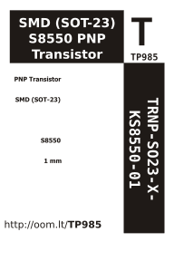

Contents
========

* [TRNP-SO23-X-KS8550-01>SMD (SOT-23) S8550 PNP Transistor](#trnp-so23-x-ks8550-01smd-sot-23-s8550-pnp-transistor)
	* [Datasheets](#datasheets)
	* [Labels](#labels)
	* [EDA](#eda)
		* [Symbols](#symbols)
	* [Tags](#tags)

# TRNP-SO23-X-KS8550-01>SMD (SOT-23) S8550 PNP Transistor

- ID: TRNP-SO23-X-KS8550-01
- Name: TRNP-SO23-X-KS8550-01

## Datasheets

- Datasheet: [datasheet.pdf](datasheet.pdf)

## Labels
  
  

|label-front|label-inventory|label-spec|
| :---: | :---: | :---: |
||||

## EDA

### Symbols

## Tags

- oompType: TRNP
- oompSize: SO23
- oompColor: X
- oompDesc: KS8550
- oompIndex: 01
- hexID: TP985
- oompID: TRNP-SO23-X-KS8550-01
