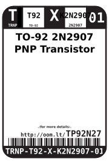
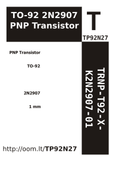

Contents
========

* [TRNP-T92-X-K2N2907-01>TO-92 2N2907 PNP Transistor](#trnp-t92-x-k2n2907-01to-92-2n2907-pnp-transistor)
	* [Labels](#labels)
	* [EDA](#eda)
		* [Symbols](#symbols)
	* [Tags](#tags)

# TRNP-T92-X-K2N2907-01>TO-92 2N2907 PNP Transistor

- ID: TRNP-T92-X-K2N2907-01
- Name: TRNP-T92-X-K2N2907-01

## Labels
  
  

|label-front|label-inventory|label-spec|
| :---: | :---: | :---: |
||||

## EDA

### Symbols

## Tags

- oompType: TRNP
- oompSize: T92
- oompColor: X
- oompDesc: K2N2907
- oompIndex: 01
- hexID: TP92N27
