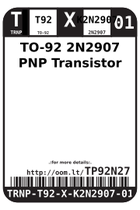
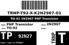
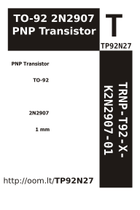

Contents
========

* [TP92N27 > TO-92 2N2907 PNP Transistor](#tp92n27--to-92-2n2907-pnp-transistor)
	* [Images](#images)
	* [Labels](#labels)
	* [EDA](#eda)
	* [Tags](#tags)

# TP92N27 > TO-92 2N2907 PNP Transistor

- ID: TRNP-T92-X-K2N2907-01
- Hex ID: TP92N27
- Name: TO-92 2N2907 PNP Transistor
- Description: TO-92 2N2907 PNP Transistor

## Images
  
  

|label-front|label-inventory|label-spec|
| :---: | :---: | :---: |
||||

## Labels
  
  

|label-front|label-inventory|label-spec|
| :---: | :---: | :---: |
||||

## EDA

### Symbols

## Tags

- oompType: TRNP
- oompSize: T92
- oompColor: X
- oompDesc: K2N2907
- oompIndex: 01
- hexID: TP92N27
- oompID: TRNP-T92-X-K2N2907-01
