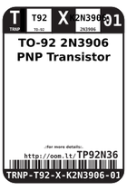
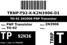
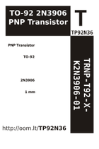

Contents
========

* [TP92N36 > ](#tp92n36--)
	* [Labels](#labels)
	* [EDA](#eda)
	* [Images](#images)
	* [Tags](#tags)

# TP92N36 > 

- ID: TRNP-T92-X-K2N3906-01
- Hex ID: TP92N36
- Name: 
- Description: 
- Long Link: [http://oom.lt/TRNP-T92-X-K2N3906-01](http://oom.lt/TRNP-T92-X-K2N3906-01)
- Short Link: [http://oom.lt/TP92N36](http://oom.lt/TP92N36)

## Labels
  
  

|label-front|label-inventory|label-spec|
| :---: | :---: | :---: |
||||

## EDA

## Images
  
  

|label-front|label-inventory|label-spec|
| :---: | :---: | :---: |
||||

## Tags

- oompType: TRNP
- oompSize: T92
- oompColor: X
- oompDesc: K2N3906
- oompIndex: 01
- hexID: TP92N36
- oompID: TRNP-T92-X-K2N3906-01
