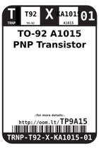
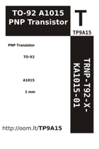

Contents
========

* [TP9A15 > ](#tp9a15--)
	* [Labels](#labels)
	* [EDA](#eda)
	* [Images](#images)
	* [Tags](#tags)

# TP9A15 > 

- ID: TRNP-T92-X-KA1015-01
- Hex ID: TP9A15
- Name: 
- Description: 
- Long Link: [http://oom.lt/TRNP-T92-X-KA1015-01](http://oom.lt/TRNP-T92-X-KA1015-01)
- Short Link: [http://oom.lt/TP9A15](http://oom.lt/TP9A15)

## Labels
  
  

|label-front|label-inventory|label-spec|
| :---: | :---: | :---: |
||||

## EDA

## Images
  
  

|label-front|label-inventory|label-spec|
| :---: | :---: | :---: |
||||

## Tags

- oompType: TRNP
- oompSize: T92
- oompColor: X
- oompDesc: KA1015
- oompIndex: 01
- hexID: TP9A15
- oompID: TRNP-T92-X-KA1015-01
