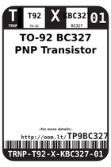
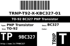
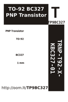

Contents
========

* [TP9BC327 > TO-92 BC327 PNP Transistor](#tp9bc327--to-92-bc327-pnp-transistor)
	* [Labels](#labels)
	* [EDA](#eda)
	* [Images](#images)
	* [Tags](#tags)

# TP9BC327 > TO-92 BC327 PNP Transistor

- ID: TRNP-T92-X-KBC327-01
- Hex ID: TP9BC327
- Name: TO-92 BC327 PNP Transistor
- Description: TO-92 BC327 PNP Transistor
- Long Link: [http://oom.lt/TRNP-T92-X-KBC327-01](http://oom.lt/TRNP-T92-X-KBC327-01)
- Short Link: [http://oom.lt/TP9BC327](http://oom.lt/TP9BC327)

## Labels
  
  

|label-front|label-inventory|label-spec|
| :---: | :---: | :---: |
||||

## EDA

## Images
  
  

|label-front|label-inventory|label-spec|
| :---: | :---: | :---: |
||||

## Tags

- oompType: TRNP
- oompSize: T92
- oompColor: X
- oompDesc: KBC327
- oompIndex: 01
- hexID: TP9BC327
- oompID: TRNP-T92-X-KBC327-01
