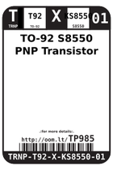
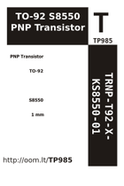

Contents
========

* [TP985 > TO-92 S8550 PNP Transistor](#tp985--to-92-s8550-pnp-transistor)
	* [Labels](#labels)
	* [EDA](#eda)
	* [Images](#images)
	* [Tags](#tags)

# TP985 > TO-92 S8550 PNP Transistor

- ID: TRNP-T92-X-KS8550-01
- Hex ID: TP985
- Name: TO-92 S8550 PNP Transistor
- Description: TO-92 S8550 PNP Transistor
- Long Link: [http://oom.lt/TRNP-T92-X-KS8550-01](http://oom.lt/TRNP-T92-X-KS8550-01)
- Long Link: [http://oom.lt/TP985](http://oom.lt/TP985)

## Labels
  
  

|label-front|label-inventory|label-spec|
| :---: | :---: | :---: |
||||

## EDA

### Symbols

## Images
  
  

|label-front|label-inventory|label-spec|
| :---: | :---: | :---: |
||||

## Tags

- oompType: TRNP
- oompSize: T92
- oompColor: X
- oompDesc: KS8550
- oompIndex: 01
- hexID: TP985
- oompID: TRNP-T92-X-KS8550-01
