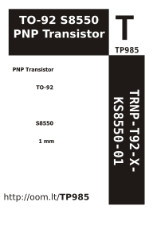

Contents
========

* [TRNP-T92-X-KS8550-01>TO-92 S8550 PNP Transistor](#trnp-t92-x-ks8550-01to-92-s8550-pnp-transistor)
	* [Labels](#labels)
	* [EDA](#eda)
		* [Symbols](#symbols)
	* [Tags](#tags)

# TRNP-T92-X-KS8550-01>TO-92 S8550 PNP Transistor

- ID: TRNP-T92-X-KS8550-01
- Name: TRNP-T92-X-KS8550-01

## Labels
  
  

|label-front|label-inventory|label-spec|
| :---: | :---: | :---: |
||||

## EDA

### Symbols

## Tags

- oompType: TRNP
- oompSize: T92
- oompColor: X
- oompDesc: KS8550
- oompIndex: 01
- hexID: TP985
- oompID: TRNP-T92-X-KS8550-01
