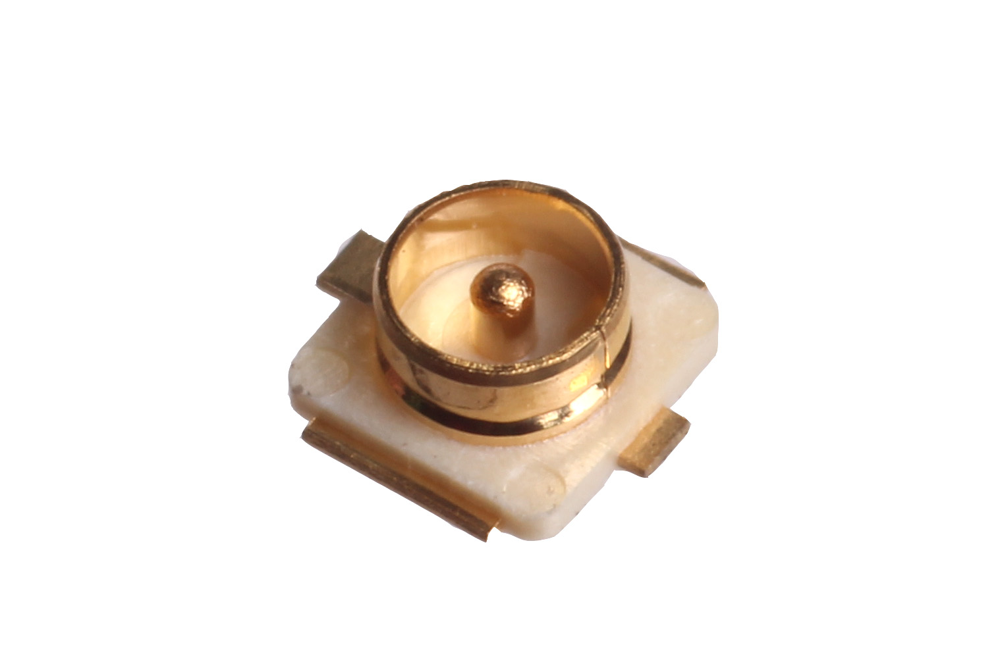
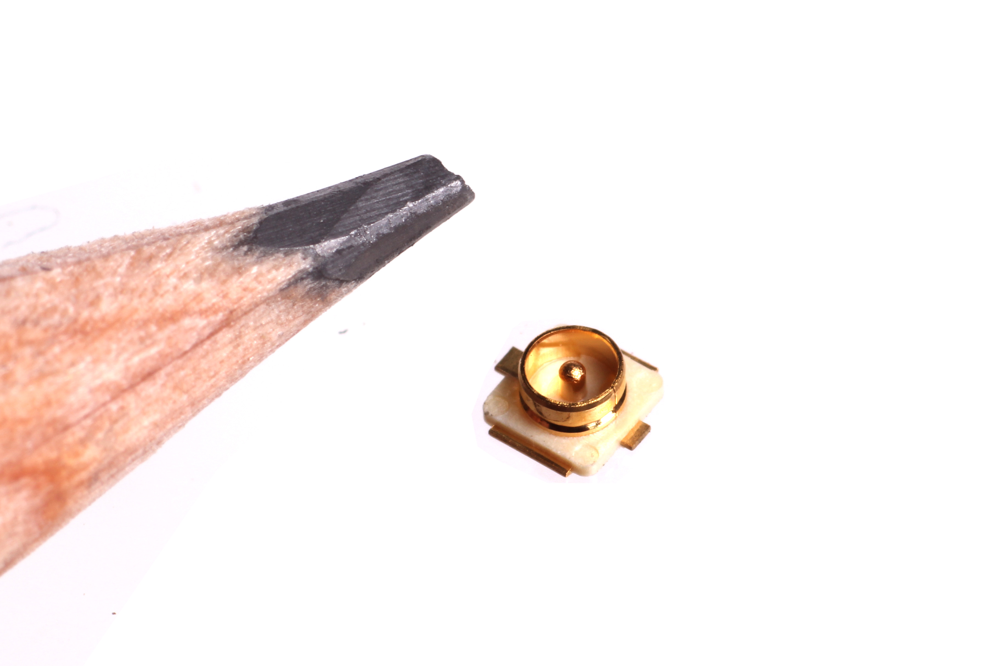

Contents
========

* [UFLS-02-M-SMDS-01>2 mm SMD Metal UFL Socket](#ufls-02-m-smds-012-mm-smd-metal-ufl-socket)
	* [Images](#images)
	* [Datasheets](#datasheets)
	* [Labels](#labels)
	* [EDA](#eda)
		* [Symbols](#symbols)
	* [Tags](#tags)
  
![][im]
# UFLS-02-M-SMDS-01>2 mm SMD Metal UFL Socket

- ID: UFLS-02-M-SMDS-01
- Name: UFLS-02-M-SMDS-01

## Images
  
  

|Main|Reference|Bottom|
| :---: | :---: | :---: |
||||

## Datasheets

- Datasheet: [datasheet.pdf](datasheet.pdf)

## Labels
  
  

|Front|Inventory|Specifications|
| :---: | :---: | :---: |
||||

## EDA

### Symbols

## Tags

- index: 13094
- oompID: UFLS-02-M-SMDS-01
- name: 2 mm SMD Metal UFL Socket
- hexID: UFL02S
- oompSort: 
- oompClass: Surface Mount
- oompClassCode: SMDS
- oompType: UFLS
- oompSize: 02
- oompColor: M
- oompDesc: SMDS
- oompIndex: 01
- oompVersion: 40
- ooDesignator: J1

[im]: image_600.jpg
