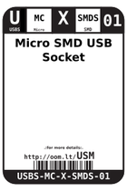
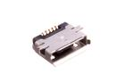

Contents
========

* [USM > Micro SMD USB Socket](#usm--micro-smd-usb-socket)
	* [Datasheets](#datasheets)
	* [Labels](#labels)
	* [EDA](#eda)
	* [Images](#images)
	* [Tags](#tags)
  
![][im]
# USM > Micro SMD USB Socket

- ID: USBS-MC-X-SMDS-01
- Hex ID: USM
- Name: Micro SMD USB Socket
- Description: Micro SMD USB Socket
- Long Link: [http://oom.lt/USBS-MC-X-SMDS-01](http://oom.lt/USBS-MC-X-SMDS-01)
- Short Link: [http://oom.lt/USM](http://oom.lt/USM)

## Datasheets

- Datasheet: [datasheet.pdf](datasheet.pdf)

## Labels
  
  

|label-front|label-inventory|label-spec|
| :---: | :---: | :---: |
||||

## EDA

### Symbols

## Images
  
  

|image|image_BOTTOM|label-front|label-inventory|label-spec|
| :---: | :---: | :---: | :---: | :---: |
||||||

## Tags

- oompID: USBS-MC-X-SMDS-01
- name: Micro SMD USB Socket
- hexID: USM
- oompSort: MCMC
- oompType: USBS
- oompSize: MC
- oompColor: X
- oompDesc: SMDS
- oompIndex: 01
- oompVersion: 99
- ooManufacturer: C-SUNT
- ooManufacturerPartNumber: ST-USB-001E
- ooSEEEDsku: 3400150P1
- ooSEEEDdesc: MICRO USB B SMD R/A
- ooSEEED3dModel: http://www.seeedstudio.com/wiki/File:B-SMD-5P.zip
- oompClass: Surface Mount
- oompClassCode: SMDS
- oompSchem: template;USBS-XXXX-X-XXXX-XX-schem
- ooDesignator: J1

[im]: image_450.jpg
