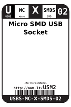
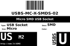
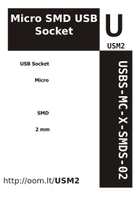

Contents
========

* [USM2 > Micro SMD USB Socket](#usm2--micro-smd-usb-socket)
	* [Datasheets](#datasheets)
	* [Labels](#labels)
	* [EDA](#eda)
	* [Images](#images)
	* [Tags](#tags)

# USM2 > Micro SMD USB Socket

- ID: USBS-MC-X-SMDS-02
- Hex ID: USM2
- Name: Micro SMD USB Socket
- Description: Micro SMD USB Socket
- Long Link: [http://oom.lt/USBS-MC-X-SMDS-02](http://oom.lt/USBS-MC-X-SMDS-02)
- Short Link: [http://oom.lt/USM2](http://oom.lt/USM2)

## Datasheets

- Datasheet: [datasheet.pdf](datasheet.pdf)

## Labels
  
  

|label-front|label-inventory|label-spec|
| :---: | :---: | :---: |
||||

## EDA

### Symbols

## Images
  
  

|label-front|label-inventory|label-spec|
| :---: | :---: | :---: |
||||

## Tags

- oompID: USBS-MC-X-SMDS-02
- name: Micro SMD USB Socket
- hexID: USM2
- oompSort: USBSMCSMDS
- oompType: USBS
- oompSize: MC
- oompColor: X
- oompDesc: SMDS
- oompIndex: 02
- oompVersion: 98
- oompSchem: template;USBS-XXXX-X-XXXX-XX-schem
- ooDesignator: J1
