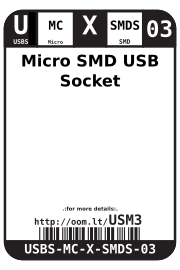
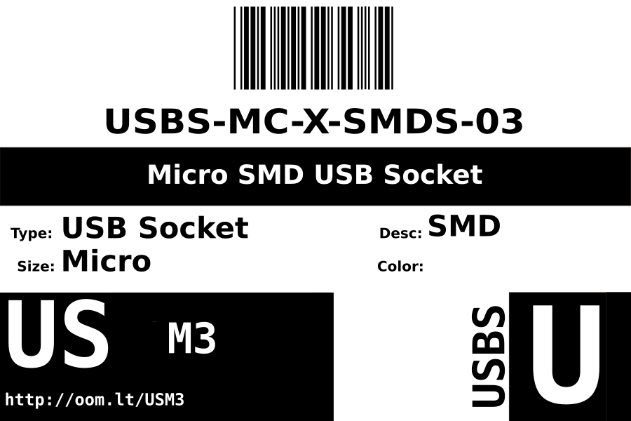

Contents
========

* [USBS-MC-X-SMDS-03>Micro SMD USB Socket](#usbs-mc-x-smds-03micro-smd-usb-socket)
	* [Datasheets](#datasheets)
	* [Labels](#labels)
	* [EDA](#eda)
		* [Symbols](#symbols)
	* [Tags](#tags)

# USBS-MC-X-SMDS-03>Micro SMD USB Socket

- ID: USBS-MC-X-SMDS-03
- Name: USBS-MC-X-SMDS-03

## Datasheets

- Datasheet: [datasheet.pdf](datasheet.pdf)

## Labels
  
  

|label-front|label-inventory|label-spec|
| :---: | :---: | :---: |
||||

## EDA

### Symbols

## Tags

- oompID: USBS-MC-X-SMDS-03
- name: Micro SMD USB Socket
- hexID: USM3
- oompSort: USBSMCSMDS
- oompType: USBS
- oompSize: MC
- oompColor: X
- oompDesc: SMDS
- oompIndex: 03
- oompVersion: 98
- oompSchem: template;USBS-XXXX-X-XXXX-XX-schem
- ooDesignator: J1
