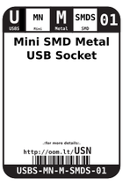
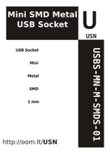
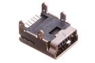

Contents
========

* [USN > Mini SMD Metal USB Socket](#usn--mini-smd-metal-usb-socket)
	* [Datasheets](#datasheets)
	* [Labels](#labels)
	* [EDA](#eda)
	* [Images](#images)
	* [Tags](#tags)
  
![][im]
# USN > Mini SMD Metal USB Socket

- ID: USBS-MN-M-SMDS-01
- Hex ID: USN
- Name: Mini SMD Metal USB Socket
- Description: Mini SMD Metal USB Socket
- Long Link: [http://oom.lt/USBS-MN-M-SMDS-01](http://oom.lt/USBS-MN-M-SMDS-01)
- Short Link: [http://oom.lt/USN](http://oom.lt/USN)

## Datasheets

- Datasheet: [datasheet.pdf](datasheet.pdf)

## Labels
  
  

|label-front|label-inventory|label-spec|
| :---: | :---: | :---: |
||||

## EDA

### Symbols

## Images
  
  

|image|image_BOTTOM|label-front|label-inventory|label-spec|
| :---: | :---: | :---: | :---: | :---: |
||||||

## Tags

- oompID: USBS-MN-M-SMDS-01
- name: Mini SMD Metal USB Socket
- hexID: USN
- oompSort: 
- oompClass: Through Hole
- oompClassCode: THTH
- oompType: USBS
- oompSize: MN
- oompColor: M
- oompDesc: SMDS
- oompIndex: 01
- oompVersion: 40
- oompSchem: template;USBS-XXXX-X-XXXX-XX-schem
- ooDesignator: J1

[im]: image_450.jpg
