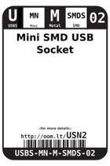
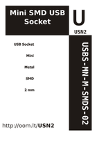
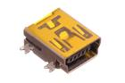
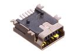

Contents
========

* [USN2 > Mini SMD USB Socket](#usn2--mini-smd-usb-socket)
	* [Datasheets](#datasheets)
	* [Labels](#labels)
	* [EDA](#eda)
	* [Images](#images)
	* [Tags](#tags)
  
![][im]
# USN2 > Mini SMD USB Socket

- ID: USBS-MN-M-SMDS-02
- Hex ID: USN2
- Name: Mini SMD USB Socket
- Description: Mini SMD USB Socket
- Long Link: [http://oom.lt/USBS-MN-M-SMDS-02](http://oom.lt/USBS-MN-M-SMDS-02)
- Short Link: [http://oom.lt/USN2](http://oom.lt/USN2)

## Datasheets

- Datasheet: [datasheet.pdf](datasheet.pdf)

## Labels
  
  

|label-front|label-inventory|label-spec|
| :---: | :---: | :---: |
||||

## EDA

## Images
  
  

|image|image_BOTTOM|label-front|label-inventory|label-spec|
| :---: | :---: | :---: | :---: | :---: |
||||||

## Tags

- oompID: USBS-MN-M-SMDS-02
- name: Mini SMD USB Socket
- hexID: USN2
- oompSort: MNMN
- oompType: USBS
- oompSize: MN
- oompColor: M
- oompDesc: SMDS
- oompIndex: 02
- oompVersion: 99
- ooManufacturer: C-SUNT
- ooManufacturerPartNumber: ST-USB-003A
- ooSEEEDsku: 3400020P1
- ooSEEEDdesc: CONN USB RCPT MINI B 5PS R/A SMD	
- ooSEEED3dModel: http://www.seeedstudio.com/wiki/File:MINI-B-SMD.zip
- oompClass: Surface Mount
- oompClassCode: SMDS
- oompSchem: template;USBS-XXXX-X-XXXX-XX-schem
- ooDesignator: J1

[im]: image_450.jpg
