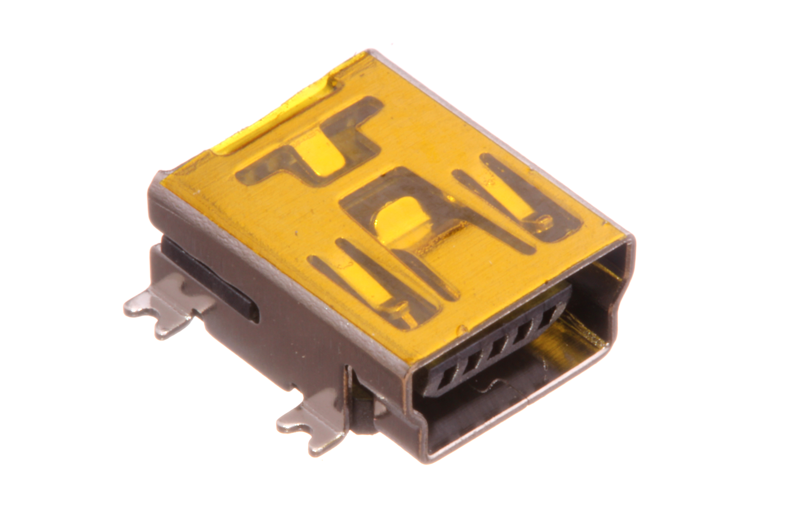
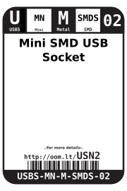
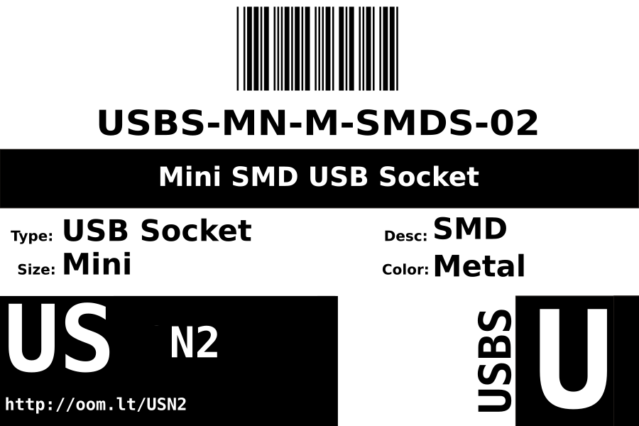
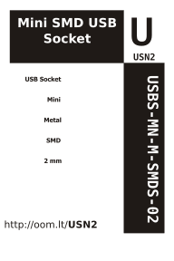

Contents
========

* [USBS-MN-M-SMDS-02>Mini SMD Metal USB Socket](#usbs-mn-m-smds-02mini-smd-metal-usb-socket)
	* [Images](#images)
	* [Datasheets](#datasheets)
	* [Labels](#labels)
	* [EDA](#eda)
		* [Symbols](#symbols)
	* [Tags](#tags)
  
![][im]
# USBS-MN-M-SMDS-02>Mini SMD Metal USB Socket

- ID: USBS-MN-M-SMDS-02
- Name: USBS-MN-M-SMDS-02

## Images
  
  

|Main|Bottom|
| :---: | :---: |
|||

## Datasheets

- Datasheet: [datasheet.pdf](datasheet.pdf)

## Labels
  
  

|Front|Inventory|Specifications|
| :---: | :---: | :---: |
||||

## EDA

### Symbols

## Tags

- hexID: USN2
- oompSort: MNMN
- oompType: USBS
- oompSize: MN
- oompColor: M
- oompDesc: SMDS
- oompIndex: 02
- oompVersion: 99
- ooManufacturer: C-SUNT
- ooManufacturerPartNumber: ST-USB-003A
- ooSEEEDsku: 3400020P1
- ooSEEEDdesc: CONN USB RCPT MINI B 5PS R/A SMD	
- ooSEEED3dModel: http://www.seeedstudio.com/wiki/File:MINI-B-SMD.zip
- oompClass: Surface Mount
- oompClassCode: SMDS
- oompSchem: template;USBS-XXXX-X-XXXX-XX-schem
- ooDesignator: J1

[im]: image_600.jpg
