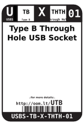
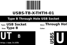

Contents
========

* [UTB > Type B Through Hole USB Socket](#utb--type-b-through-hole-usb-socket)
	* [Datasheets](#datasheets)
	* [Labels](#labels)
	* [EDA](#eda)
	* [Images](#images)
	* [Tags](#tags)

# UTB > Type B Through Hole USB Socket

- ID: USBS-TB-X-THTH-01
- Hex ID: UTB
- Name: Type B Through Hole USB Socket
- Description: Type B Through Hole USB Socket
- Long Link: [http://oom.lt/USBS-TB-X-THTH-01](http://oom.lt/USBS-TB-X-THTH-01)
- Long Link: [http://oom.lt/UTB](http://oom.lt/UTB)

## Datasheets

- Datasheet: [datasheet.pdf](datasheet.pdf)

## Labels
  
  

|label-front|label-inventory|label-spec|
| :---: | :---: | :---: |
||||

## EDA

### Symbols

## Images
  
  

|label-front|label-inventory|label-spec|
| :---: | :---: | :---: |
||||

## Tags

- oompID: USBS-TB-X-THTH-01
- name: Type B Through Hole USB Socket
- hexID: UTB
- oompSort: THTHTB
- oompType: USBS
- oompSize: TB
- oompColor: X
- oompDesc: THTH
- oompIndex: 01
- oompVersion: 99
- oompSkip: true
- ooWidth: 16 mm
- ooHeight: 10.3 mm
- ooLength: 12.2 mm
- ooNumPins: 4
- oompClass: Through Hole Component
- oompClassCode: THTH
- oompSchem: template;USBS-XXXX-X-XXXX-XX-schem
- ooDesignator: J1
