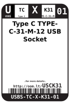
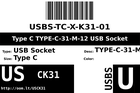
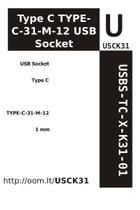

Contents
========

* [USCK31 > ](#usck31--)
	* [Datasheets](#datasheets)
	* [Labels](#labels)
	* [EDA](#eda)
	* [Images](#images)
	* [Tags](#tags)

# USCK31 > 

- ID: USBS-TC-X-K31-01
- Hex ID: USCK31
- Name: 
- Description: 
- Long Link: [http://oom.lt/USBS-TC-X-K31-01](http://oom.lt/USBS-TC-X-K31-01)
- Short Link: [http://oom.lt/USCK31](http://oom.lt/USCK31)

## Datasheets

- Datasheet: [datasheet.pdf](datasheet.pdf)

## Labels
  
  

|label-front|label-inventory|label-spec|
| :---: | :---: | :---: |
||||

## EDA

## Images
  
  

|label-front|label-inventory|label-spec|
| :---: | :---: | :---: |
||||

## Tags

- oompType: USBS
- oompSize: TC
- oompColor: X
- oompDesc: K31
- oompIndex: 01
- distributorPartNumber: {'companyName': 'LCSC', 'companyCode': 'C-LCSC', 'partNumber': 'C165948'}
- manufacturerPartNumber: {'companyName': 'Korean Hroparts Elec', 'companyCode': 'C-KHRO', 'partNumber': 'TYPE-C-31-M-12'}
- hexID: USCK31
- oompID: USBS-TC-X-K31-01
