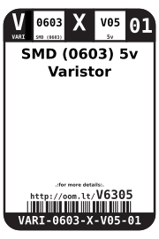
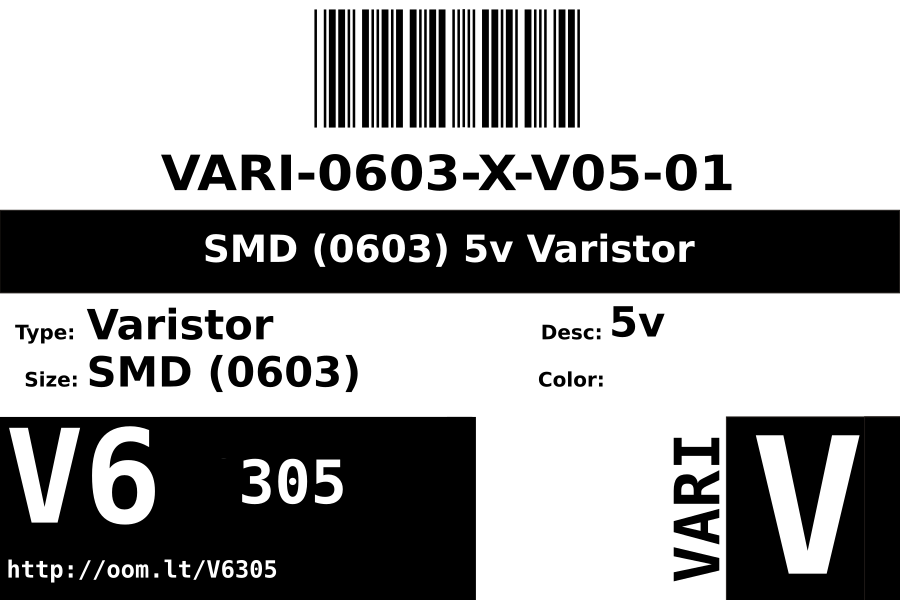
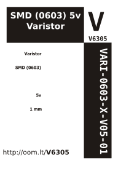

Contents
========

* [VARI-0603-X-V05-01>SMD (0603) 5v Varistor](#vari-0603-x-v05-01smd-0603-5v-varistor)
	* [Datasheets](#datasheets)
	* [Labels](#labels)
	* [EDA](#eda)
		* [Symbols](#symbols)
	* [Tags](#tags)

# VARI-0603-X-V05-01>SMD (0603) 5v Varistor

- ID: VARI-0603-X-V05-01
- Name: VARI-0603-X-V05-01

## Datasheets

- Datasheet: [datasheet.pdf](datasheet.pdf)

## Labels
  
  

|Front|Inventory|Specifications|
| :---: | :---: | :---: |
||||

## EDA

### Symbols

## Tags

- index: 803
- index: 9876
- oompID: VARI-0603-X-V05-01
- name: SMD (0603) 5v Varistor
- hexID: V6305
- oompSort: 060305.0
- oompType: VARI
- oompSize: 0603
- oompColor: X
- oompDesc: V05
- oompIndex: 01
- oompVersion: 99
- oompSkip: true
- ooWidth: 1.6 mm
- ooHeight: 0.45 mm
- ooLength: 0.8 mm
- ooNumPins: 2
- oompClass: Surface Mount
- oompClassCode: SMDS
- oompBbls: template;XXXX-0603-X-XXXX-XX-bbls
- oompDiag: template;XXXX-0603-X-XXXX-XX-diag
- oompIden: template;XXXX-0603-X-XXXX-XX-iden
- oompSchem: template;VARI-XXXX-X-XXXX-XX-schem
- oompSimp: template;XXXX-0603-X-XXXX-XX-simp
