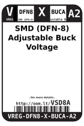
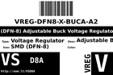
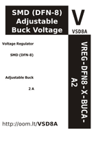

Contents
========

* [VSD8A > SMD (DFN-8) Adjustable Buck Voltage Regulator 2 A](#vsd8a--smd-dfn-8-adjustable-buck-voltage-regulator-2-a)
	* [Datasheets](#datasheets)
	* [Labels](#labels)
	* [EDA](#eda)
	* [Images](#images)
	* [Tags](#tags)

# VSD8A > SMD (DFN-8) Adjustable Buck Voltage Regulator 2 A

- ID: VREG-DFN8-X-BUCA-A2
- Hex ID: VSD8A
- Name: SMD (DFN-8) Adjustable Buck Voltage Regulator 2 A
- Description: SMD (DFN-8) Adjustable Buck Voltage Regulator 2 A
- Long Link: [http://oom.lt/VREG-DFN8-X-BUCA-A2](http://oom.lt/VREG-DFN8-X-BUCA-A2)
- Long Link: [http://oom.lt/VSD8A](http://oom.lt/VSD8A)

## Datasheets

- Datasheet: [datasheet.pdf](datasheet.pdf)

## Labels
  
  

|label-front|label-inventory|label-spec|
| :---: | :---: | :---: |
||||

## EDA

### Symbols

## Images
  
  

|label-front|label-inventory|label-spec|
| :---: | :---: | :---: |
||||

## Tags

- oompID: VREG-DFN8-X-BUCA-A2
- name: SMD (DFN-8) Adjustable Buck Voltage Regulator 2 A
- hexID: VSD8A
- oompSort: VREGDFN8BUCA
- oompType: VREG
- oompSize: DFN8
- oompColor: X
- oompDesc: BUCA
- oompIndex: A2
- oompVersion: 98
- ooDesignator: U1
