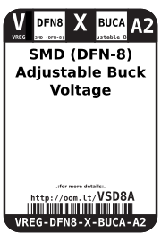

Contents
========

* [VREG-DFN8-X-BUCA-A2>SMD (DFN-8) Adjustable Buck Voltage Regulator 2 A](#vreg-dfn8-x-buca-a2smd-dfn-8-adjustable-buck-voltage-regulator-2-a)
	* [Datasheets](#datasheets)
	* [Labels](#labels)
	* [EDA](#eda)
		* [Symbols](#symbols)
	* [Tags](#tags)

# VREG-DFN8-X-BUCA-A2>SMD (DFN-8) Adjustable Buck Voltage Regulator 2 A

- ID: VREG-DFN8-X-BUCA-A2
- Name: VREG-DFN8-X-BUCA-A2

## Datasheets

- Datasheet: [datasheet.pdf](datasheet.pdf)

## Labels
  
  

|Front|Inventory|Specifications|
| :---: | :---: | :---: |
||||

## EDA

### Symbols

## Tags

- index: 13103
- oompID: VREG-DFN8-X-BUCA-A2
- name: SMD (DFN-8) Adjustable Buck Voltage Regulator 2 A
- hexID: VSD8A
- oompSort: VREGDFN8BUCA
- oompType: VREG
- oompSize: DFN8
- oompColor: X
- oompDesc: BUCA
- oompIndex: A2
- oompVersion: 98
- ooDesignator: U1
