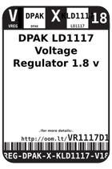
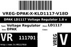
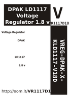

Contents
========

* [VR1117D18 > DPAK LD1117 Voltage Regulator 1.8 v](#vr1117d18--dpak-ld1117-voltage-regulator-18-v)
	* [Datasheets](#datasheets)
	* [Labels](#labels)
	* [EDA](#eda)
	* [Images](#images)
	* [Tags](#tags)

# VR1117D18 > DPAK LD1117 Voltage Regulator 1.8 v

- ID: VREG-DPAK-X-KLD1117-V18D
- Hex ID: VR1117D18
- Name: DPAK LD1117 Voltage Regulator 1.8 v
- Description: DPAK LD1117 Voltage Regulator 1.8 v
- Long Link: [http://oom.lt/VREG-DPAK-X-KLD1117-V18D](http://oom.lt/VREG-DPAK-X-KLD1117-V18D)
- Short Link: [http://oom.lt/VR1117D18](http://oom.lt/VR1117D18)

## Datasheets

- Datasheet: [datasheet.pdf](datasheet.pdf)

## Labels
  
  

|label-front|label-inventory|label-spec|
| :---: | :---: | :---: |
||||

## EDA

## Images
  
  

|label-front|label-inventory|label-spec|
| :---: | :---: | :---: |
||||

## Tags

- oompType: VREG
- oompSize: DPAK
- oompColor: X
- oompDesc: KLD1117
- oompIndex: V18D
- hexID: VR1117D18
- oompID: VREG-DPAK-X-KLD1117-V18D
