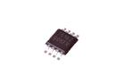

Contents
========

* [VREG-MS08-X-ADJU-A1>8 Pin SMD (MSOP) Adjustable Voltage Regulator 1 A](#vreg-ms08-x-adju-a18-pin-smd-msop-adjustable-voltage-regulator-1-a)
	* [Images](#images)
	* [Datasheets](#datasheets)
	* [Labels](#labels)
	* [EDA](#eda)
		* [Symbols](#symbols)
	* [Tags](#tags)
  
![][im]
# VREG-MS08-X-ADJU-A1>8 Pin SMD (MSOP) Adjustable Voltage Regulator 1 A

- ID: VREG-MS08-X-ADJU-A1
- Name: VREG-MS08-X-ADJU-A1

## Images
  
  

|image|image_RE|image_BOTTOM|
| :---: | :---: | :---: |
||||

## Datasheets

- Datasheet: [datasheet.pdf](datasheet.pdf)

## Labels
  
  

|label-front|label-inventory|label-spec|
| :---: | :---: | :---: |
||||

## EDA

### Symbols

## Tags

- oompID: VREG-MS08-X-ADJU-A1
- name: 8 Pin SMD (MSOP) Adjustable Voltage Regulator 1 A
- hexID: VS8A1
- oompSort: VREGMS08ADJU
- oompType: VREG
- oompSize: MS08
- oompColor: X
- oompDesc: ADJU
- oompIndex: A1
- oompVersion: 98
- ooNumPins: 8
- ooDesignator: U

[im]: image_600.jpg
