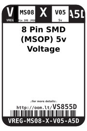
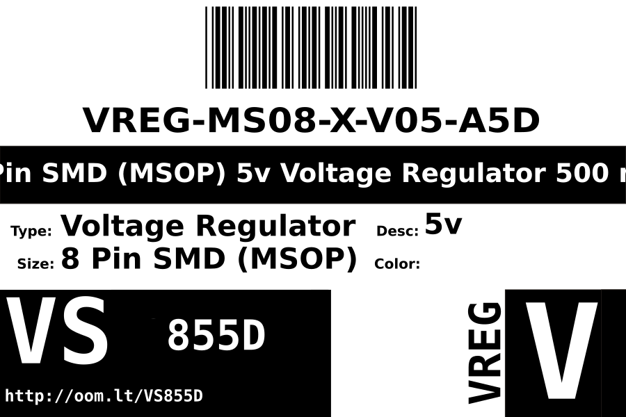
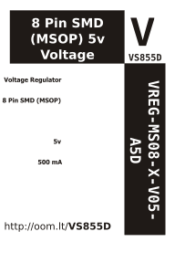

Contents
========

* [VREG-MS08-X-V05-A5D>8 Pin SMD (MSOP) 5v Voltage Regulator 500 mA](#vreg-ms08-x-v05-a5d8-pin-smd-msop-5v-voltage-regulator-500-ma)
	* [Datasheets](#datasheets)
	* [Labels](#labels)
	* [EDA](#eda)
		* [Symbols](#symbols)
	* [Tags](#tags)

# VREG-MS08-X-V05-A5D>8 Pin SMD (MSOP) 5v Voltage Regulator 500 mA

- ID: VREG-MS08-X-V05-A5D
- Name: VREG-MS08-X-V05-A5D

## Datasheets

- Datasheet: [datasheet.pdf](datasheet.pdf)

## Labels
  
  

|Front|Inventory|Specifications|
| :---: | :---: | :---: |
||||

## EDA

### Symbols

## Tags

- hexID: VS855D
- oompSort: VREGMS08V05
- oompType: VREG
- oompSize: MS08
- oompColor: X
- oompDesc: V05
- oompIndex: A5D
- oompVersion: 98
- ooNumPins: 8
- ooDesignator: U
