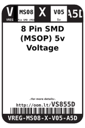
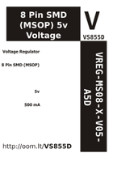

Contents
========

* [VS855D > 8 Pin SMD (MSOP) 5v Voltage Regulator 500 mA](#vs855d--8-pin-smd-msop-5v-voltage-regulator-500-ma)
	* [Datasheets](#datasheets)
	* [Labels](#labels)
	* [EDA](#eda)
	* [Images](#images)
	* [Tags](#tags)

# VS855D > 8 Pin SMD (MSOP) 5v Voltage Regulator 500 mA

- ID: VREG-MS08-X-V05-A5D
- Hex ID: VS855D
- Name: 8 Pin SMD (MSOP) 5v Voltage Regulator 500 mA
- Description: 8 Pin SMD (MSOP) 5v Voltage Regulator 500 mA
- Long Link: [http://oom.lt/VREG-MS08-X-V05-A5D](http://oom.lt/VREG-MS08-X-V05-A5D)
- Long Link: [http://oom.lt/VS855D](http://oom.lt/VS855D)

## Datasheets

- Datasheet: [datasheet.pdf](datasheet.pdf)

## Labels
  
  

|label-front|label-inventory|label-spec|
| :---: | :---: | :---: |
||||

## EDA

### Symbols

## Images
  
  

|label-front|label-inventory|label-spec|
| :---: | :---: | :---: |
||||

## Tags

- oompID: VREG-MS08-X-V05-A5D
- name: 8 Pin SMD (MSOP) 5v Voltage Regulator 500 mA
- hexID: VS855D
- oompSort: VREGMS08V05
- oompType: VREG
- oompSize: MS08
- oompColor: X
- oompDesc: V05
- oompIndex: A5D
- oompVersion: 98
- ooNumPins: 8
- ooDesignator: U
