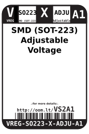

Contents
========

* [VREG-SO223-X-ADJU-A1>SMD (SOT-223) Adjustable Voltage Regulator 1 A](#vreg-so223-x-adju-a1smd-sot-223-adjustable-voltage-regulator-1-a)
	* [Datasheets](#datasheets)
	* [Labels](#labels)
	* [EDA](#eda)
		* [Symbols](#symbols)
	* [Tags](#tags)

# VREG-SO223-X-ADJU-A1>SMD (SOT-223) Adjustable Voltage Regulator 1 A

- ID: VREG-SO223-X-ADJU-A1
- Name: VREG-SO223-X-ADJU-A1

## Datasheets

- Datasheet: [datasheet.pdf](datasheet.pdf)

## Labels
  
  

|Front|Inventory|Specifications|
| :---: | :---: | :---: |
||||

## EDA

### Symbols

## Tags

- oompID: VREG-SO223-X-ADJU-A1
- name: SMD (SOT-223) Adjustable Voltage Regulator 1 A
- hexID: VS2A1
- oompSort: 
- oompClass: Surface Mount
- oompClassCode: SMDS
- oompType: VREG
- oompSize: SO223
- oompColor: X
- oompDesc: ADJU
- oompIndex: A1
- oompVersion: 40
- ooDesignator: U1
