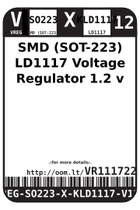

Contents
========

* [VR111722312 > ](#vr111722312--)
	* [Datasheets](#datasheets)
	* [Labels](#labels)
	* [EDA](#eda)
	* [Images](#images)
	* [Tags](#tags)

# VR111722312 > 

- ID: VREG-SO223-X-KLD1117-V12D
- Hex ID: VR111722312
- Name: 
- Description: 
- Long Link: [http://oom.lt/VREG-SO223-X-KLD1117-V12D](http://oom.lt/VREG-SO223-X-KLD1117-V12D)
- Short Link: [http://oom.lt/VR111722312](http://oom.lt/VR111722312)

## Datasheets

- Datasheet: [datasheet.pdf](datasheet.pdf)

## Labels
  
  

|label-front|label-inventory|label-spec|
| :---: | :---: | :---: |
||||

## EDA

## Images
  
  

|label-front|label-inventory|label-spec|
| :---: | :---: | :---: |
||||

## Tags

- oompType: VREG
- oompSize: SO223
- oompColor: X
- oompDesc: KLD1117
- oompIndex: V12D
- hexID: VR111722312
- oompID: VREG-SO223-X-KLD1117-V12D
