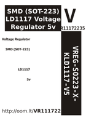

Contents
========

* [VR11172235 > SMD (SOT-223) LD1117 Voltage Regulator 5v](#vr11172235--smd-sot-223-ld1117-voltage-regulator-5v)
	* [Datasheets](#datasheets)
	* [Labels](#labels)
	* [EDA](#eda)
	* [Images](#images)
	* [Tags](#tags)

# VR11172235 > SMD (SOT-223) LD1117 Voltage Regulator 5v

- ID: VREG-SO223-X-KLD1117-V5
- Hex ID: VR11172235
- Name: SMD (SOT-223) LD1117 Voltage Regulator 5v
- Description: SMD (SOT-223) LD1117 Voltage Regulator 5v
- Long Link: [http://oom.lt/VREG-SO223-X-KLD1117-V5](http://oom.lt/VREG-SO223-X-KLD1117-V5)
- Short Link: [http://oom.lt/VR11172235](http://oom.lt/VR11172235)

## Datasheets

- Datasheet: [datasheet.pdf](datasheet.pdf)

## Labels
  
  

|label-front|label-inventory|label-spec|
| :---: | :---: | :---: |
||||

## EDA

## Images
  
  

|label-front|label-inventory|label-spec|
| :---: | :---: | :---: |
||||

## Tags

- oompType: VREG
- oompSize: SO223
- oompColor: X
- oompDesc: KLD1117
- oompIndex: V5
- hexID: VR11172235
- oompID: VREG-SO223-X-KLD1117-V5
