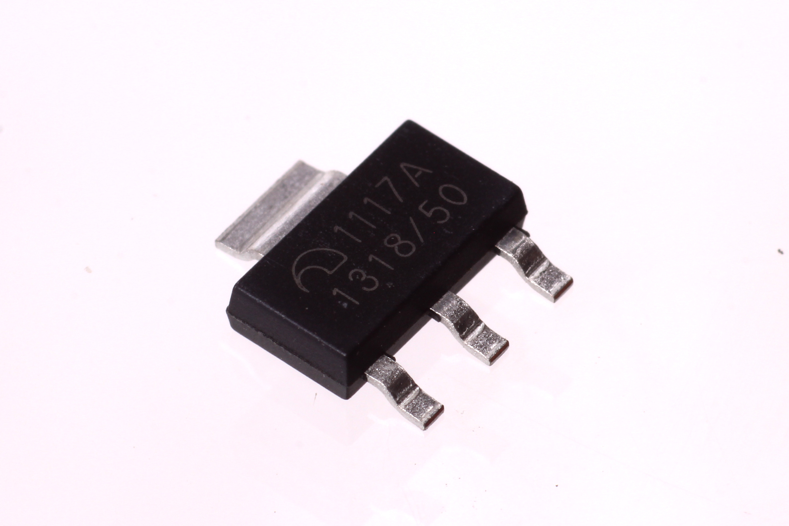
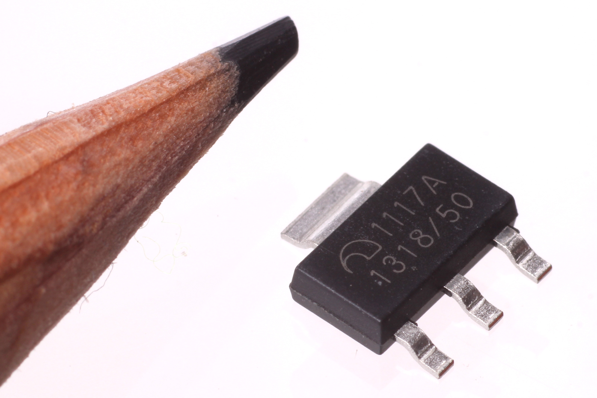

Contents
========

* [VREG-SO223-X-V05-A1>SMD (SOT-223) 5v Voltage Regulator 1 A](#vreg-so223-x-v05-a1smd-sot-223-5v-voltage-regulator-1-a)
	* [Images](#images)
	* [Datasheets](#datasheets)
	* [EDA](#eda)
		* [Symbols](#symbols)
	* [Tags](#tags)
  
![][im]
# VREG-SO223-X-V05-A1>SMD (SOT-223) 5v Voltage Regulator 1 A

- ID: VREG-SO223-X-V05-A1
- Name: VREG-SO223-X-V05-A1

## Images
  
  

|Main|Reference|Bottom|
| :---: | :---: | :---: |
||||

## Datasheets

- Datasheet: [datasheet.pdf](datasheet.pdf)

## EDA

### Symbols

## Tags

- index: 808
- oompID: VREG-SO223-X-V05-A1
- name: SMD (SOT-223) 5v Voltage Regulator 1 A
- hexID: VS251
- oompSort: 
- oompClass: Surface Mount
- oompClassCode: SDMS
- oompType: VREG
- oompSize: SO223
- oompColor: X
- oompDesc: V05
- oompIndex: A1
- oompVersion: 99
- ooDesignator: U1

[im]: image_600.jpg
