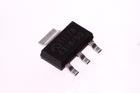

Contents
========

* [VS251 > SMD (SOT-223) 5v Voltage Regulator 1 A](#vs251--smd-sot-223-5v-voltage-regulator-1-a)
	* [Datasheets](#datasheets)
	* [Labels](#labels)
	* [EDA](#eda)
	* [Images](#images)
	* [Tags](#tags)
  
![][im]
# VS251 > SMD (SOT-223) 5v Voltage Regulator 1 A

- ID: VREG-SO223-X-V05-A1
- Hex ID: VS251
- Name: SMD (SOT-223) 5v Voltage Regulator 1 A
- Description: SMD (SOT-223) 5v Voltage Regulator 1 A
- Long Link: [http://oom.lt/VREG-SO223-X-V05-A1](http://oom.lt/VREG-SO223-X-V05-A1)
- Short Link: [http://oom.lt/VS251](http://oom.lt/VS251)

## Datasheets

- Datasheet: [datasheet.pdf](datasheet.pdf)

## Labels
  
  

|label-front|label-inventory|label-spec|
| :---: | :---: | :---: |
||||

## EDA

### Symbols

## Images
  
  

|image|image_RE|image_BOTTOM|label-front|label-inventory|label-spec|
| :---: | :---: | :---: | :---: | :---: | :---: |
|||||||

## Tags

- oompID: VREG-SO223-X-V05-A1
- name: SMD (SOT-223) 5v Voltage Regulator 1 A
- hexID: VS251
- oompSort: 
- oompClass: Surface Mount
- oompClassCode: SDMS
- oompType: VREG
- oompSize: SO223
- oompColor: X
- oompDesc: V05
- oompIndex: A1
- oompVersion: 99
- ooDesignator: U1

[im]: image_450.jpg
