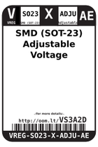
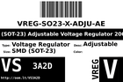
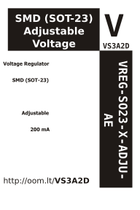

Contents
========

* [VS3A2D > SMD (SOT-23) Adjustable Voltage Regulator 200 mA](#vs3a2d--smd-sot-23-adjustable-voltage-regulator-200-ma)
	* [Datasheets](#datasheets)
	* [Labels](#labels)
	* [EDA](#eda)
	* [Images](#images)
	* [Tags](#tags)
  
![][im]
# VS3A2D > SMD (SOT-23) Adjustable Voltage Regulator 200 mA

- ID: VREG-SO23-X-ADJU-AE
- Hex ID: VS3A2D
- Name: SMD (SOT-23) Adjustable Voltage Regulator 200 mA
- Description: SMD (SOT-23) Adjustable Voltage Regulator 200 mA
- Long Link: [http://oom.lt/VREG-SO23-X-ADJU-AE](http://oom.lt/VREG-SO23-X-ADJU-AE)
- Short Link: [http://oom.lt/VS3A2D](http://oom.lt/VS3A2D)

## Datasheets

- Datasheet: [datasheet.pdf](datasheet.pdf)

## Labels
  
  

|label-front|label-inventory|label-spec|
| :---: | :---: | :---: |
||||

## EDA

### Symbols

## Images
  
  

|image|label-front|label-inventory|label-spec|
| :---: | :---: | :---: | :---: |
|||||

## Tags

- oompID: VREG-SO23-X-ADJU-AE
- name: SMD (SOT-23) Adjustable Voltage Regulator 200 mA
- hexID: VS3A2D
- oompSort: VREGSO23ADJU
- oompType: VREG
- oompSize: SO23
- oompColor: X
- oompDesc: ADJU
- oompIndex: AE
- oompVersion: 98
- ooNumPins: 3
- ooPin1: REF
- ooPin2: CATH
- ooPin3: ANODE
- oompBbls: template;XXXX-SO23-X-XXXX-01-bbls
- oompDiag: template;XXXX-SO23-X-XXXX-01-diag
- oompIden: template;XXXX-SO23-X-XXXX-01-iden
- oompSimp: template;XXXX-SO23-X-XXXX-01-simp
- ooPackageMarking: 432
- ooDesignator: U1

[im]: image_450.jpg
