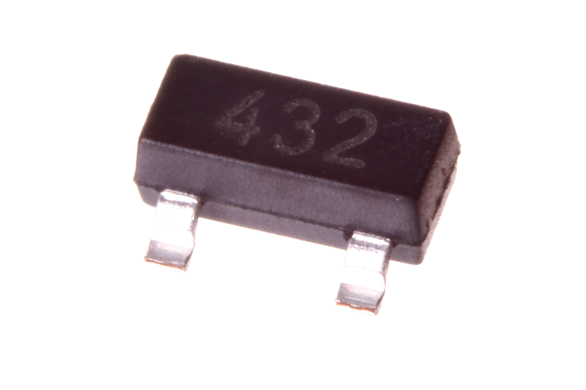

Contents
========

* [VREG-SO23-X-ADJU-AE>SMD (SOT-23) Adjustable Voltage Regulator 200 mA](#vreg-so23-x-adju-aesmd-sot-23-adjustable-voltage-regulator-200-ma)
	* [Images](#images)
	* [Datasheets](#datasheets)
	* [EDA](#eda)
		* [Footprints](#footprints)
		* [Symbols](#symbols)
	* [Tags](#tags)
  
![][im]
# VREG-SO23-X-ADJU-AE>SMD (SOT-23) Adjustable Voltage Regulator 200 mA

- ID: VREG-SO23-X-ADJU-AE
- Name: VREG-SO23-X-ADJU-AE

## Images
  
  

|Main|
| :---: |
||

## Datasheets

- Datasheet: [datasheet.pdf](datasheet.pdf)

## EDA

### Footprints
  

|||||
| :---: | :---: | :---: | :---: |

### Symbols

## Tags

- index: 810
- oompID: VREG-SO23-X-ADJU-AE
- name: SMD (SOT-23) Adjustable Voltage Regulator 200 mA
- hexID: VS3A2D
- oompSort: VREGSO23ADJU
- oompType: VREG
- oompSize: SO23
- oompColor: X
- oompDesc: ADJU
- oompIndex: AE
- oompVersion: 98
- ooNumPins: 3
- ooPin1: REF
- ooPin2: CATH
- ooPin3: ANODE
- oompBbls: template;XXXX-SO23-X-XXXX-01-bbls
- oompDiag: template;XXXX-SO23-X-XXXX-01-diag
- oompIden: template;XXXX-SO23-X-XXXX-01-iden
- oompSimp: template;XXXX-SO23-X-XXXX-01-simp
- ooPackageMarking: 432
- ooDesignator: U1

[im]: image_600.jpg
