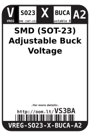
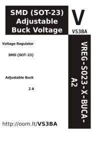

Contents
========

* [VREG-SO23-X-BUCA-A2>SMD (SOT-23) Adjustable Buck Voltage Regulator 2 A](#vreg-so23-x-buca-a2smd-sot-23-adjustable-buck-voltage-regulator-2-a)
	* [Images](#images)
	* [Datasheets](#datasheets)
	* [Labels](#labels)
	* [EDA](#eda)
		* [Symbols](#symbols)
	* [Tags](#tags)
  
![][im]
# VREG-SO23-X-BUCA-A2>SMD (SOT-23) Adjustable Buck Voltage Regulator 2 A

- ID: VREG-SO23-X-BUCA-A2
- Name: VREG-SO23-X-BUCA-A2

## Images
  
  

|image|
| :---: |
||

## Datasheets

- Datasheet: [datasheet.pdf](datasheet.pdf)

## Labels
  
  

|label-front|label-inventory|label-spec|
| :---: | :---: | :---: |
||||

## EDA

### Symbols

## Tags

- oompID: VREG-SO23-X-BUCA-A2
- name: SMD (SOT-23) Adjustable Buck Voltage Regulator 2 A
- hexID: VS3BA
- oompSort: VREGSO23BUCA
- oompType: VREG
- oompSize: SO23
- oompColor: X
- oompDesc: BUCA
- oompIndex: A2
- oompVersion: 98
- ooPin1: VSS
- ooPin2: VOUT
- ooPin3: VIN
- oompBbls: template;XXXX-SO23-X-XXXX-01-bbls
- oompDiag: template;XXXX-SO23-X-XXXX-01-diag
- oompIden: template;XXXX-SO23-X-XXXX-01-iden
- oompSimp: template;XXXX-SO23-X-XXXX-01-simp
- ooPackageMarking: 65KA
- ooDesignator: U1

[im]: image_600.jpg
