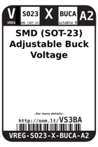
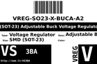
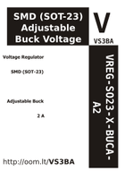

Contents
========

* [VS3BA > SMD (SOT-23) Adjustable Buck Voltage Regulator 2 A](#vs3ba--smd-sot-23-adjustable-buck-voltage-regulator-2-a)
	* [Datasheets](#datasheets)
	* [Labels](#labels)
	* [EDA](#eda)
	* [Images](#images)
	* [Tags](#tags)
  
![][im]
# VS3BA > SMD (SOT-23) Adjustable Buck Voltage Regulator 2 A

- ID: VREG-SO23-X-BUCA-A2
- Hex ID: VS3BA
- Name: SMD (SOT-23) Adjustable Buck Voltage Regulator 2 A
- Description: SMD (SOT-23) Adjustable Buck Voltage Regulator 2 A
- Long Link: [http://oom.lt/VREG-SO23-X-BUCA-A2](http://oom.lt/VREG-SO23-X-BUCA-A2)
- Short Link: [http://oom.lt/VS3BA](http://oom.lt/VS3BA)

## Datasheets

- Datasheet: [datasheet.pdf](datasheet.pdf)

## Labels
  
  

|label-front|label-inventory|label-spec|
| :---: | :---: | :---: |
||||

## EDA

### Symbols

## Images
  
  

|image|label-front|label-inventory|label-spec|
| :---: | :---: | :---: | :---: |
|||||

## Tags

- oompID: VREG-SO23-X-BUCA-A2
- name: SMD (SOT-23) Adjustable Buck Voltage Regulator 2 A
- hexID: VS3BA
- oompSort: VREGSO23BUCA
- oompType: VREG
- oompSize: SO23
- oompColor: X
- oompDesc: BUCA
- oompIndex: A2
- oompVersion: 98
- ooPin1: VSS
- ooPin2: VOUT
- ooPin3: VIN
- oompBbls: template;XXXX-SO23-X-XXXX-01-bbls
- oompDiag: template;XXXX-SO23-X-XXXX-01-diag
- oompIden: template;XXXX-SO23-X-XXXX-01-iden
- oompSimp: template;XXXX-SO23-X-XXXX-01-simp
- ooPackageMarking: 65KA
- ooDesignator: U1

[im]: image_450.jpg
