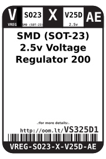
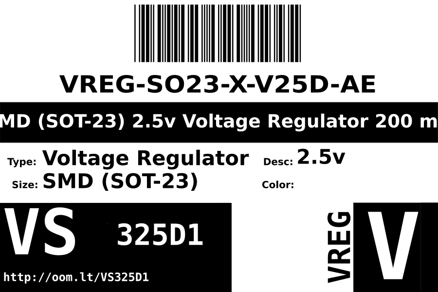
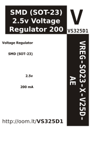

Contents
========

* [VREG-SO23-X-V25D-AE>SMD (SOT-23) 2.5v Voltage Regulator 200 mA](#vreg-so23-x-v25d-aesmd-sot-23-25v-voltage-regulator-200-ma)
	* [Images](#images)
	* [Datasheets](#datasheets)
	* [Labels](#labels)
	* [EDA](#eda)
		* [Symbols](#symbols)
	* [Tags](#tags)
  
![][im]
# VREG-SO23-X-V25D-AE>SMD (SOT-23) 2.5v Voltage Regulator 200 mA

- ID: VREG-SO23-X-V25D-AE
- Name: VREG-SO23-X-V25D-AE

## Images
  
  

|image|
| :---: |
||

## Datasheets

- Datasheet: [datasheet.pdf](datasheet.pdf)

## Labels
  
  

|label-front|label-inventory|label-spec|
| :---: | :---: | :---: |
||||

## EDA

### Symbols

## Tags

- oompID: VREG-SO23-X-V25D-AE
- name: SMD (SOT-23) 2.5v Voltage Regulator 200 mA
- hexID: VS325D1
- oompSort: VREGSO23V25D
- oompType: VREG
- oompSize: SO23
- oompColor: X
- oompDesc: V25D
- oompIndex: AE
- oompVersion: 98
- ooPin1: VSS
- ooPin2: VOUT
- ooPin3: VIN
- oompBbls: template;XXXX-SO23-X-XXXX-01-bbls
- oompDiag: template;XXXX-SO23-X-XXXX-01-diag
- oompIden: template;XXXX-SO23-X-XXXX-01-iden
- oompSimp: template;XXXX-SO23-X-XXXX-01-simp
- ooPackageMarking: 65T
- ooDesignator: U1

[im]: image_600.jpg
