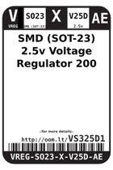
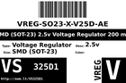
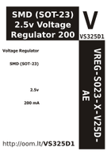
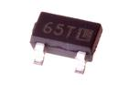

Contents
========

* [VS325D1 > SMD (SOT-23) 2.5v Voltage Regulator 200 mA](#vs325d1--smd-sot-23-25v-voltage-regulator-200-ma)
	* [Datasheets](#datasheets)
	* [Labels](#labels)
	* [EDA](#eda)
	* [Images](#images)
	* [Tags](#tags)
  
![][im]
# VS325D1 > SMD (SOT-23) 2.5v Voltage Regulator 200 mA

- ID: VREG-SO23-X-V25D-AE
- Hex ID: VS325D1
- Name: SMD (SOT-23) 2.5v Voltage Regulator 200 mA
- Description: SMD (SOT-23) 2.5v Voltage Regulator 200 mA
- Long Link: [http://oom.lt/VREG-SO23-X-V25D-AE](http://oom.lt/VREG-SO23-X-V25D-AE)
- Short Link: [http://oom.lt/VS325D1](http://oom.lt/VS325D1)

## Datasheets

- Datasheet: [datasheet.pdf](datasheet.pdf)

## Labels
  
  

|label-front|label-inventory|label-spec|
| :---: | :---: | :---: |
||||

## EDA

### Symbols

## Images
  
  

|image|label-front|label-inventory|label-spec|
| :---: | :---: | :---: | :---: |
|||||

## Tags

- oompID: VREG-SO23-X-V25D-AE
- name: SMD (SOT-23) 2.5v Voltage Regulator 200 mA
- hexID: VS325D1
- oompSort: VREGSO23V25D
- oompType: VREG
- oompSize: SO23
- oompColor: X
- oompDesc: V25D
- oompIndex: AE
- oompVersion: 98
- ooPin1: VSS
- ooPin2: VOUT
- ooPin3: VIN
- oompBbls: template;XXXX-SO23-X-XXXX-01-bbls
- oompDiag: template;XXXX-SO23-X-XXXX-01-diag
- oompIden: template;XXXX-SO23-X-XXXX-01-iden
- oompSimp: template;XXXX-SO23-X-XXXX-01-simp
- ooPackageMarking: 65T
- ooDesignator: U1

[im]: image_450.jpg
