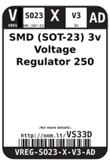
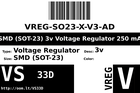
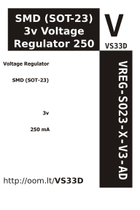

Contents
========

* [VS33D > SMD (SOT-23) 3v Voltage Regulator 250 mA](#vs33d--smd-sot-23-3v-voltage-regulator-250-ma)
	* [Datasheets](#datasheets)
	* [Labels](#labels)
	* [EDA](#eda)
	* [Images](#images)
	* [Tags](#tags)

# VS33D > SMD (SOT-23) 3v Voltage Regulator 250 mA

- ID: VREG-SO23-X-V3-AD
- Hex ID: VS33D
- Name: SMD (SOT-23) 3v Voltage Regulator 250 mA
- Description: SMD (SOT-23) 3v Voltage Regulator 250 mA
- Long Link: [http://oom.lt/VREG-SO23-X-V3-AD](http://oom.lt/VREG-SO23-X-V3-AD)
- Long Link: [http://oom.lt/VS33D](http://oom.lt/VS33D)

## Datasheets

- Datasheet: [datasheet.pdf](datasheet.pdf)

## Labels
  
  

|label-front|label-inventory|label-spec|
| :---: | :---: | :---: |
||||

## EDA

### Symbols

## Images
  
  

|label-front|label-inventory|label-spec|
| :---: | :---: | :---: |
||||

## Tags

- oompID: VREG-SO23-X-V3-AD
- name: SMD (SOT-23) 3v Voltage Regulator 250 mA
- hexID: VS33D
- oompSort: 
- oompClass: Surface Mount
- oompClassCode: SMDS
- oompType: VREG
- oompSize: SO23
- oompColor: X
- oompDesc: V3
- oompIndex: AD
- oompVersion: 40
- ooPin1: VSS
- ooPin2: VOUT
- ooPin3: VIN
- oompBbls: template;XXXX-SO23-X-XXXX-01-bbls
- oompDiag: template;XXXX-SO23-X-XXXX-01-diag
- oompIden: template;XXXX-SO23-X-XXXX-01-iden
- oompSimp: template;XXXX-SO23-X-XXXX-01-simp
- ooPackageMarking: 65Z5
- ooDesignator: U1
