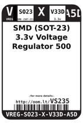
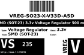
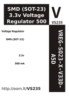

Contents
========

* [VS235 > SMD (SOT-23) 3.3v Voltage Regulator 500 mA](#vs235--smd-sot-23-33v-voltage-regulator-500-ma)
	* [Datasheets](#datasheets)
	* [Labels](#labels)
	* [EDA](#eda)
	* [Images](#images)
	* [Tags](#tags)

# VS235 > SMD (SOT-23) 3.3v Voltage Regulator 500 mA

- ID: VREG-SO23-X-V33D-A5D
- Hex ID: VS235
- Name: SMD (SOT-23) 3.3v Voltage Regulator 500 mA
- Description: SMD (SOT-23) 3.3v Voltage Regulator 500 mA
- Long Link: [http://oom.lt/VREG-SO23-X-V33D-A5D](http://oom.lt/VREG-SO23-X-V33D-A5D)
- Long Link: [http://oom.lt/VS235](http://oom.lt/VS235)

## Datasheets

- Datasheet: [datasheet.pdf](datasheet.pdf)

## Labels
  
  

|label-front|label-inventory|label-spec|
| :---: | :---: | :---: |
||||

## EDA

### Symbols

## Images
  
  

|label-front|label-inventory|label-spec|
| :---: | :---: | :---: |
||||

## Tags

- oompID: VREG-SO23-X-V33D-A5D
- name: SMD (SOT-23) 3.3v Voltage Regulator 500 mA
- hexID: VS235
- oompSort: SO233.300.500
- oompType: VREG
- oompSize: SO23
- oompColor: X
- oompDesc: V33D
- oompIndex: A5D
- oompVersion: 99
- ooManufacturer: C-TORE
- ooManufacturerPartNumber: XC6206P332MR-G
- ooSEEEDsku: 1300260P1
- ooSEEEDdesc: 
- ooSEEED3dModel: http://www.seeedstudio.com/wiki/File:SOT23.zip
- oompClass: Surface Mount
- oompClassCode: SMDS
- ooPin1: VSS
- ooPin2: VOUT
- ooPin3: VIN
- oompBbls: template;XXXX-SO23-X-XXXX-01-bbls
- oompDiag: template;XXXX-SO23-X-XXXX-01-diag
- oompIden: template;XXXX-SO23-X-XXXX-01-iden
- oompSimp: template;XXXX-SO23-X-XXXX-01-simp
- ooPackageMarking: 662K
- ooDesignator: D1
