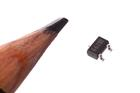
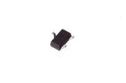
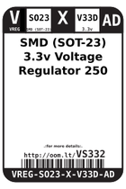
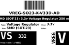
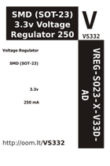

Contents
========

* [VS332 > SMD (SOT-23) 3.3v Voltage Regulator 250 mA](#vs332--smd-sot-23-33v-voltage-regulator-250-ma)
	* [Images](#images)
	* [Datasheets](#datasheets)
	* [Labels](#labels)
	* [EDA](#eda)
	* [Tags](#tags)
  
![][im]
# VS332 > SMD (SOT-23) 3.3v Voltage Regulator 250 mA

- ID: VREG-SO23-X-V33D-AD
- Hex ID: VS332
- Name: SMD (SOT-23) 3.3v Voltage Regulator 250 mA
- Description: SMD (SOT-23) 3.3v Voltage Regulator 250 mA

## Images
  
  

|image|image_RE|image_BOTTOM|label-front|label-inventory|label-spec|
| :---: | :---: | :---: | :---: | :---: | :---: |
|||||||

## Datasheets

- Datasheet: [datasheet.pdf](datasheet.pdf)

## Labels
  
  

|label-front|label-inventory|label-spec|
| :---: | :---: | :---: |
||||

## EDA

### Symbols

## Tags

- oompID: VREG-SO23-X-V33D-AD
- name: SMD (SOT-23) 3.3v Voltage Regulator 250 mA
- hexID: VS332
- oompSort: SO233.300.250
- oompType: VREG
- oompSize: SO23
- oompColor: X
- oompDesc: V33D
- oompIndex: AD
- oompVersion: 99
- oompClass: Surface Mount
- oompClassCode: SMDS
- ooPin1: VSS
- ooPin2: VOUT
- ooPin3: VIN
- oompBbls: template;XXXX-SO23-X-XXXX-01-bbls
- oompDiag: template;XXXX-SO23-X-XXXX-01-diag
- oompIden: template;XXXX-SO23-X-XXXX-01-iden
- oompSimp: template;XXXX-SO23-X-XXXX-01-simp
- ooPackageMarking: 662S
- ooDesignator: U1

[im]: image_450.jpg
