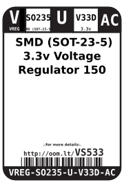
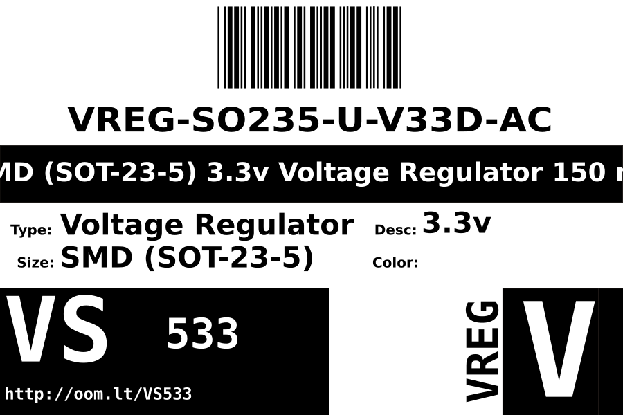
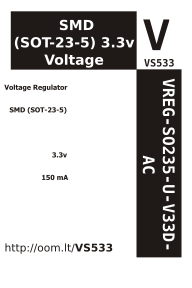

Contents
========

* [VREG-SO235-U-V33D-AC> SMD (SOT-23-5) 3.3v Voltage Regulator 150 mA ](#vreg-so235-u-v33d-ac-smd-sot-23-5-33v-voltage-regulator-150-ma-)
	* [Datasheets](#datasheets)
	* [Labels](#labels)
	* [EDA](#eda)
		* [Symbols](#symbols)
	* [Tags](#tags)

# VREG-SO235-U-V33D-AC> SMD (SOT-23-5) 3.3v Voltage Regulator 150 mA 

- ID: VREG-SO235-U-V33D-AC
- Name: VREG-SO235-U-V33D-AC

## Datasheets

- Datasheet: [datasheet.pdf](datasheet.pdf)

## Labels
  
  

|Front|Inventory|Specifications|
| :---: | :---: | :---: |
||||

## EDA

### Symbols

## Tags

- oompID: VREG-SO235-U-V33D-AC
- name:  SMD (SOT-23-5) 3.3v Voltage Regulator 150 mA 
- hexID: VS533
- oompSort: VREGSO235V33D
- oompType: VREG
- oompSize: SO235
- oompColor: U
- oompDesc: V33D
- oompIndex: AC
- oompVersion: 98
- ooNumPins: 5
- ooDesignator: U1
