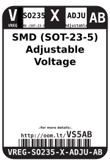
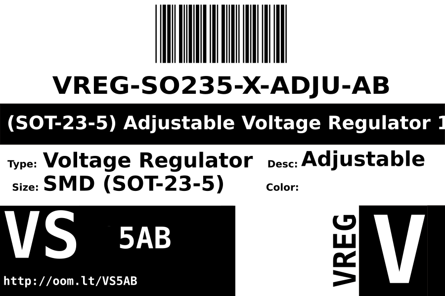
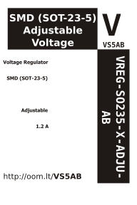

Contents
========

* [VREG-SO235-X-ADJU-AB>SMD (SOT-23-5) Adjustable Voltage Regulator 1.2 A](#vreg-so235-x-adju-absmd-sot-23-5-adjustable-voltage-regulator-12-a)
	* [Datasheets](#datasheets)
	* [Labels](#labels)
	* [EDA](#eda)
		* [Symbols](#symbols)
	* [Tags](#tags)

# VREG-SO235-X-ADJU-AB>SMD (SOT-23-5) Adjustable Voltage Regulator 1.2 A

- ID: VREG-SO235-X-ADJU-AB
- Name: VREG-SO235-X-ADJU-AB

## Datasheets

- Datasheet: [datasheet.pdf](datasheet.pdf)

## Labels
  
  

|label-front|label-inventory|label-spec|
| :---: | :---: | :---: |
||||

## EDA

### Symbols

## Tags

- oompID: VREG-SO235-X-ADJU-AB
- name: SMD (SOT-23-5) Adjustable Voltage Regulator 1.2 A
- hexID: VS5AB
- oompSort: 
- oompClass: Surface Mount
- oompClassCode: SMDS
- oompType: VREG
- oompSize: SO235
- oompColor: X
- oompDesc: ADJU
- oompIndex: AB
- oompVersion: 40
- ooDesignator: U1
