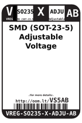

Contents
========

* [VS5AB > SMD (SOT-23-5) Adjustable Voltage Regulator 1.2 A](#vs5ab--smd-sot-23-5-adjustable-voltage-regulator-12-a)
	* [Images](#images)
	* [Datasheets](#datasheets)
	* [Labels](#labels)
	* [EDA](#eda)
	* [Tags](#tags)

# VS5AB > SMD (SOT-23-5) Adjustable Voltage Regulator 1.2 A

- ID: VREG-SO235-X-ADJU-AB
- Hex ID: VS5AB
- Name: SMD (SOT-23-5) Adjustable Voltage Regulator 1.2 A
- Description: SMD (SOT-23-5) Adjustable Voltage Regulator 1.2 A

## Images
  
  

|label-front|label-inventory|label-spec|
| :---: | :---: | :---: |
||||

## Datasheets

- Datasheet: [datasheet.pdf](datasheet.pdf)

## Labels
  
  

|label-front|label-inventory|label-spec|
| :---: | :---: | :---: |
||||

## EDA

### Symbols

## Tags

- oompID: VREG-SO235-X-ADJU-AB
- name: SMD (SOT-23-5) Adjustable Voltage Regulator 1.2 A
- hexID: VS5AB
- oompSort: 
- oompClass: Surface Mount
- oompClassCode: SMDS
- oompType: VREG
- oompSize: SO235
- oompColor: X
- oompDesc: ADJU
- oompIndex: AB
- oompVersion: 40
- ooDesignator: U1
