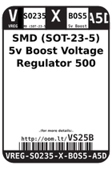
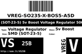

Contents
========

* [VS25B > SMD (SOT-23-5) 5v Boost Voltage Regulator 500 mA](#vs25b--smd-sot-23-5-5v-boost-voltage-regulator-500-ma)
	* [Datasheets](#datasheets)
	* [Labels](#labels)
	* [EDA](#eda)
	* [Images](#images)
	* [Tags](#tags)

# VS25B > SMD (SOT-23-5) 5v Boost Voltage Regulator 500 mA

- ID: VREG-SO235-X-BOS5-A5D
- Hex ID: VS25B
- Name: SMD (SOT-23-5) 5v Boost Voltage Regulator 500 mA
- Description: SMD (SOT-23-5) 5v Boost Voltage Regulator 500 mA
- Long Link: [http://oom.lt/VREG-SO235-X-BOS5-A5D](http://oom.lt/VREG-SO235-X-BOS5-A5D)
- Short Link: [http://oom.lt/VS25B](http://oom.lt/VS25B)

## Datasheets

- Datasheet: [datasheet.pdf](datasheet.pdf)

## Labels
  
  

|label-front|label-inventory|label-spec|
| :---: | :---: | :---: |
||||

## EDA

### Symbols

## Images
  
  

|label-front|label-inventory|label-spec|
| :---: | :---: | :---: |
||||

## Tags

- oompID: VREG-SO235-X-BOS5-A5D
- name: SMD (SOT-23-5) 5v Boost Voltage Regulator 500 mA
- hexID: VS25B
- oompSort: VREGSO235BOS5
- oompType: VREG
- oompSize: SO235
- oompColor: X
- oompDesc: BOS5
- oompIndex: A5D
- oompVersion: 98
- ooDesignator: U1
