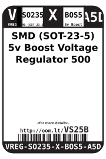
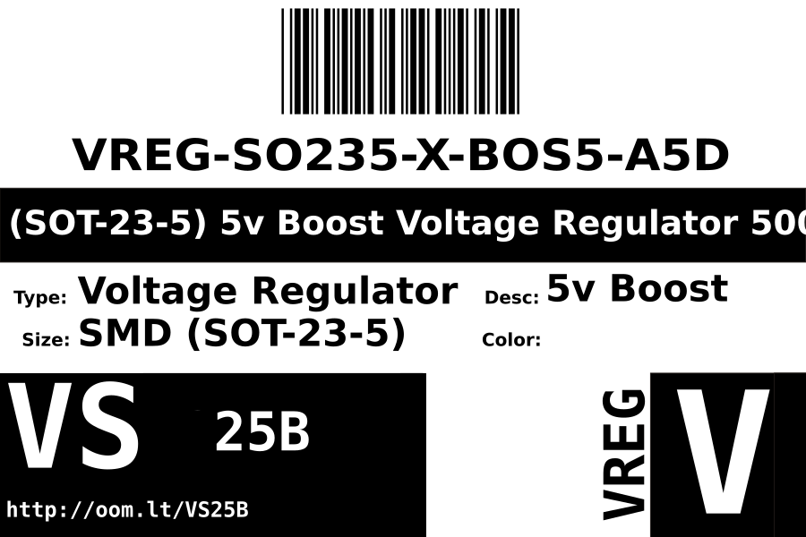
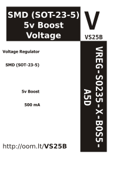

Contents
========

* [VREG-SO235-X-BOS5-A5D>SMD (SOT-23-5) 5v Boost Voltage Regulator 500 mA](#vreg-so235-x-bos5-a5dsmd-sot-23-5-5v-boost-voltage-regulator-500-ma)
	* [Datasheets](#datasheets)
	* [Labels](#labels)
	* [EDA](#eda)
		* [Symbols](#symbols)
	* [Tags](#tags)

# VREG-SO235-X-BOS5-A5D>SMD (SOT-23-5) 5v Boost Voltage Regulator 500 mA

- ID: VREG-SO235-X-BOS5-A5D
- Name: VREG-SO235-X-BOS5-A5D

## Datasheets

- Datasheet: [datasheet.pdf](datasheet.pdf)

## Labels
  
  

|label-front|label-inventory|label-spec|
| :---: | :---: | :---: |
||||

## EDA

### Symbols

## Tags

- oompID: VREG-SO235-X-BOS5-A5D
- name: SMD (SOT-23-5) 5v Boost Voltage Regulator 500 mA
- hexID: VS25B
- oompSort: VREGSO235BOS5
- oompType: VREG
- oompSize: SO235
- oompColor: X
- oompDesc: BOS5
- oompIndex: A5D
- oompVersion: 98
- ooDesignator: U1
