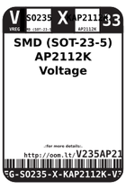
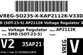
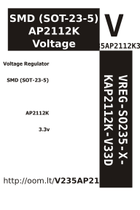

Contents
========

* [V235AP2112K33 > SMD (SOT-23-5) AP2112K Voltage Regulator 3.3v](#v235ap2112k33--smd-sot-23-5-ap2112k-voltage-regulator-33v)
	* [Datasheets](#datasheets)
	* [Labels](#labels)
	* [EDA](#eda)
	* [Images](#images)
	* [Tags](#tags)

# V235AP2112K33 > SMD (SOT-23-5) AP2112K Voltage Regulator 3.3v

- ID: VREG-SO235-X-KAP2112K-V33D
- Hex ID: V235AP2112K33
- Name: SMD (SOT-23-5) AP2112K Voltage Regulator 3.3v
- Description: SMD (SOT-23-5) AP2112K Voltage Regulator 3.3v
- Long Link: [http://oom.lt/VREG-SO235-X-KAP2112K-V33D](http://oom.lt/VREG-SO235-X-KAP2112K-V33D)
- Short Link: [http://oom.lt/V235AP2112K33](http://oom.lt/V235AP2112K33)

## Datasheets

- Datasheet: [datasheet.pdf](datasheet.pdf)

## Labels
  
  

|label-front|label-inventory|label-spec|
| :---: | :---: | :---: |
||||

## EDA

### Footprints
  

|[  FOOTPRINT-kicad-kicad-footprints-Package_TO_SOT_SMD-SOT-23-5](https://github.com/oomlout/oomlout_OOMP_eda/tree/main/FOOTPRINT/kicad/kicad-footprints/Package_TO_SOT_SMD/SOT-23-5/)|[  FOOTPRINT-kicad-kicad-footprints-Package_TO_SOT_SMD-SOT-23-5_HandSoldering](https://github.com/oomlout/oomlout_OOMP_eda/tree/main/FOOTPRINT/kicad/kicad-footprints/Package_TO_SOT_SMD/SOT-23-5_HandSoldering/)|||
| :---: | :---: | :---: | :---: |

### Symbols
  

|[  SYMBOL-kicad-kicad-symbols-Regulator_Linear-AP2112K-3.3](https://github.com/oomlout/oomlout_OOMP_eda/tree/main/SYMBOL/kicad/kicad-symbols/Regulator_Linear/AP2112K-3.3/)||||
| :---: | :---: | :---: | :---: |

## Images
  
  

|label-front|label-inventory|label-spec|
| :---: | :---: | :---: |
||||

## Tags

- oompType: VREG
- oompSize: SO235
- oompColor: X
- oompDesc: KAP2112K
- oompIndex: V33D
- hexID: V235AP2112K33
- oompID: VREG-SO235-X-KAP2112K-V33D
- symbolKicad: SYMBOL-kicad-kicad-symbols-Regulator_Linear-AP2112K-3.3
- footprintKicad: FOOTPRINT-kicad-kicad-footprints-Package_TO_SOT_SMD-SOT-23-5
- footprintKicad: FOOTPRINT-kicad-kicad-footprints-Package_TO_SOT_SMD-SOT-23-5_HandSoldering
