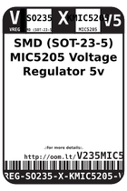
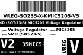
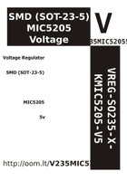

Contents
========

* [V235MIC52055 > SMD (SOT-23-5) MIC5205 Voltage Regulator 5v](#v235mic52055--smd-sot-23-5-mic5205-voltage-regulator-5v)
	* [Datasheets](#datasheets)
	* [Labels](#labels)
	* [EDA](#eda)
	* [Images](#images)
	* [Tags](#tags)

# V235MIC52055 > SMD (SOT-23-5) MIC5205 Voltage Regulator 5v

- ID: VREG-SO235-X-KMIC5205-V5
- Hex ID: V235MIC52055
- Name: SMD (SOT-23-5) MIC5205 Voltage Regulator 5v
- Description: SMD (SOT-23-5) MIC5205 Voltage Regulator 5v
- Long Link: [http://oom.lt/VREG-SO235-X-KMIC5205-V5](http://oom.lt/VREG-SO235-X-KMIC5205-V5)
- Short Link: [http://oom.lt/V235MIC52055](http://oom.lt/V235MIC52055)

## Datasheets

- Datasheet: [datasheet.pdf](datasheet.pdf)

## Labels
  
  

|label-front|label-inventory|label-spec|
| :---: | :---: | :---: |
||||

## EDA

### Symbols

## Images
  
  

|label-front|label-inventory|label-spec|
| :---: | :---: | :---: |
||||

## Tags

- oompType: VREG
- oompSize: SO235
- oompColor: X
- oompDesc: KMIC5205
- oompIndex: V5
- hexID: V235MIC52055
- oompID: VREG-SO235-X-KMIC5205-V5
