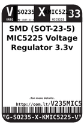
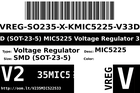
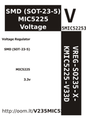

Contents
========

* [V235MIC522533 > SMD (SOT-23-5) MIC5225 Voltage Regulator 3.3v](#v235mic522533--smd-sot-23-5-mic5225-voltage-regulator-33v)
	* [Datasheets](#datasheets)
	* [Labels](#labels)
	* [EDA](#eda)
	* [Images](#images)
	* [Tags](#tags)

# V235MIC522533 > SMD (SOT-23-5) MIC5225 Voltage Regulator 3.3v

- ID: VREG-SO235-X-KMIC5225-V33D
- Hex ID: V235MIC522533
- Name: SMD (SOT-23-5) MIC5225 Voltage Regulator 3.3v
- Description: SMD (SOT-23-5) MIC5225 Voltage Regulator 3.3v
- Long Link: [http://oom.lt/VREG-SO235-X-KMIC5225-V33D](http://oom.lt/VREG-SO235-X-KMIC5225-V33D)
- Short Link: [http://oom.lt/V235MIC522533](http://oom.lt/V235MIC522533)

## Datasheets

- Datasheet: [datasheet.pdf](datasheet.pdf)

## Labels
  
  

|label-front|label-inventory|label-spec|
| :---: | :---: | :---: |
||||

## EDA
  

### Instances
  
Used 54 times.  
Prevalance: (54\10986) 0.4915%  

|Project|Occur- rences|Identifiers|
| :---: | :---: | :---: |
|[PROJ-ADAF-1032-STAN-01 Adafruit L3GD20 Breakout PCB](https://github.com/oomlout/oomlout_OOMP_projects/tree/main/PROJ-ADAF-1032-STAN-01/)|[1](https://github.com/oomlout/oomlout_OOMP_projects/tree/main/PROJ-ADAF-1032-STAN-01/)|[IC1](https://github.com/oomlout/oomlout_OOMP_projects/tree/main/PROJ-ADAF-1032-STAN-01/)|
|[PROJ-ADAF-1222-STAN-01 Adafruit Gemma PCB](https://github.com/oomlout/oomlout_OOMP_projects/tree/main/PROJ-ADAF-1222-STAN-01/)|[1](https://github.com/oomlout/oomlout_OOMP_projects/tree/main/PROJ-ADAF-1222-STAN-01/)|[IC2](https://github.com/oomlout/oomlout_OOMP_projects/tree/main/PROJ-ADAF-1222-STAN-01/)|
|[PROJ-ADAF-1272-STAN-01 Adafruit GPS Logger Shield PCB](https://github.com/oomlout/oomlout_OOMP_projects/tree/main/PROJ-ADAF-1272-STAN-01/)|[1](https://github.com/oomlout/oomlout_OOMP_projects/tree/main/PROJ-ADAF-1272-STAN-01/)|[U2](https://github.com/oomlout/oomlout_OOMP_projects/tree/main/PROJ-ADAF-1272-STAN-01/)|
|[PROJ-ADAF-1500-STAN-01 Adafruit Trinket PCB](https://github.com/oomlout/oomlout_OOMP_projects/tree/main/PROJ-ADAF-1500-STAN-01/)|[1](https://github.com/oomlout/oomlout_OOMP_projects/tree/main/PROJ-ADAF-1500-STAN-01/)|[IC2](https://github.com/oomlout/oomlout_OOMP_projects/tree/main/PROJ-ADAF-1500-STAN-01/)|
|[PROJ-ADAF-1535-STAN-01 Adafruit Bluefruit EZ Key PCB](https://github.com/oomlout/oomlout_OOMP_projects/tree/main/PROJ-ADAF-1535-STAN-01/)|[1](https://github.com/oomlout/oomlout_OOMP_projects/tree/main/PROJ-ADAF-1535-STAN-01/)|[U2](https://github.com/oomlout/oomlout_OOMP_projects/tree/main/PROJ-ADAF-1535-STAN-01/)|
|[PROJ-ADAF-1571-STAN-01 Adafruit STMPE610 Breakout PCB](https://github.com/oomlout/oomlout_OOMP_projects/tree/main/PROJ-ADAF-1571-STAN-01/)|[1](https://github.com/oomlout/oomlout_OOMP_projects/tree/main/PROJ-ADAF-1571-STAN-01/)|[U2](https://github.com/oomlout/oomlout_OOMP_projects/tree/main/PROJ-ADAF-1571-STAN-01/)|
|[PROJ-ADAF-1588-STAN-01 Adafruit Bluefruit Classic PCBs](https://github.com/oomlout/oomlout_OOMP_projects/tree/main/PROJ-ADAF-1588-STAN-01/)|[1](https://github.com/oomlout/oomlout_OOMP_projects/tree/main/PROJ-ADAF-1588-STAN-01/)|[U2](https://github.com/oomlout/oomlout_OOMP_projects/tree/main/PROJ-ADAF-1588-STAN-01/)|
|[PROJ-ADAF-1590-STAN-01 Adafruit RA8875 Breakout Board PCB](https://github.com/oomlout/oomlout_OOMP_projects/tree/main/PROJ-ADAF-1590-STAN-01/)|[1](https://github.com/oomlout/oomlout_OOMP_projects/tree/main/PROJ-ADAF-1590-STAN-01/)|[U4](https://github.com/oomlout/oomlout_OOMP_projects/tree/main/PROJ-ADAF-1590-STAN-01/)|
|[PROJ-ADAF-1601-STAN-01 Adafruit PiTFT 2.8 inch Display PCB](https://github.com/oomlout/oomlout_OOMP_projects/tree/main/PROJ-ADAF-1601-STAN-01/)|[1](https://github.com/oomlout/oomlout_OOMP_projects/tree/main/PROJ-ADAF-1601-STAN-01/)|[IC4](https://github.com/oomlout/oomlout_OOMP_projects/tree/main/PROJ-ADAF-1601-STAN-01/)|
|[PROJ-ADAF-1602-STAN-01 Adafruit CAP1188 PCB](https://github.com/oomlout/oomlout_OOMP_projects/tree/main/PROJ-ADAF-1602-STAN-01/)|[1](https://github.com/oomlout/oomlout_OOMP_projects/tree/main/PROJ-ADAF-1602-STAN-01/)|[U2](https://github.com/oomlout/oomlout_OOMP_projects/tree/main/PROJ-ADAF-1602-STAN-01/)|
|[PROJ-ADAF-1603-STAN-01 Adafruit BMP180 PCB](https://github.com/oomlout/oomlout_OOMP_projects/tree/main/PROJ-ADAF-1603-STAN-01/)|[1](https://github.com/oomlout/oomlout_OOMP_projects/tree/main/PROJ-ADAF-1603-STAN-01/)|[U2](https://github.com/oomlout/oomlout_OOMP_projects/tree/main/PROJ-ADAF-1603-STAN-01/)|
|[PROJ-ADAF-1628-STAN-01 Adafruit Bluefruit EZ Link Shield PCB](https://github.com/oomlout/oomlout_OOMP_projects/tree/main/PROJ-ADAF-1628-STAN-01/)|[1](https://github.com/oomlout/oomlout_OOMP_projects/tree/main/PROJ-ADAF-1628-STAN-01/)|[U2](https://github.com/oomlout/oomlout_OOMP_projects/tree/main/PROJ-ADAF-1628-STAN-01/)|
|[PROJ-ADAF-1651-STAN-01 Adafruit 2.8 TFT Shield v2 PCB](https://github.com/oomlout/oomlout_OOMP_projects/tree/main/PROJ-ADAF-1651-STAN-01/)|[1](https://github.com/oomlout/oomlout_OOMP_projects/tree/main/PROJ-ADAF-1651-STAN-01/)|[IC4](https://github.com/oomlout/oomlout_OOMP_projects/tree/main/PROJ-ADAF-1651-STAN-01/)|
|[PROJ-ADAF-1673-STAN-01 Adafruit 1.27inch Color OLED Breakout PCB](https://github.com/oomlout/oomlout_OOMP_projects/tree/main/PROJ-ADAF-1673-STAN-01/)|[1](https://github.com/oomlout/oomlout_OOMP_projects/tree/main/PROJ-ADAF-1673-STAN-01/)|[U2](https://github.com/oomlout/oomlout_OOMP_projects/tree/main/PROJ-ADAF-1673-STAN-01/)|
|[PROJ-ADAF-1697-STAN-01 Adafruit Bluefruit LE nRF8001 PCB](https://github.com/oomlout/oomlout_OOMP_projects/tree/main/PROJ-ADAF-1697-STAN-01/)|[1](https://github.com/oomlout/oomlout_OOMP_projects/tree/main/PROJ-ADAF-1697-STAN-01/)|[U2](https://github.com/oomlout/oomlout_OOMP_projects/tree/main/PROJ-ADAF-1697-STAN-01/)|
|[PROJ-ADAF-1727-STAN-01 Adafruit MAX31850 thermocouple breakout board](https://github.com/oomlout/oomlout_OOMP_projects/tree/main/PROJ-ADAF-1727-STAN-01/)|[1](https://github.com/oomlout/oomlout_OOMP_projects/tree/main/PROJ-ADAF-1727-STAN-01/)|[U2](https://github.com/oomlout/oomlout_OOMP_projects/tree/main/PROJ-ADAF-1727-STAN-01/)|
|[PROJ-ADAF-1746-STAN-01 Adafruit HMC5883 Mag Compass Sensor PCB](https://github.com/oomlout/oomlout_OOMP_projects/tree/main/PROJ-ADAF-1746-STAN-01/)|[1](https://github.com/oomlout/oomlout_OOMP_projects/tree/main/PROJ-ADAF-1746-STAN-01/)|[U2](https://github.com/oomlout/oomlout_OOMP_projects/tree/main/PROJ-ADAF-1746-STAN-01/)|
|[PROJ-ADAF-1752-STAN-01 Adafruit MAX9744 Amplifier PCB](https://github.com/oomlout/oomlout_OOMP_projects/tree/main/PROJ-ADAF-1752-STAN-01/)|[1](https://github.com/oomlout/oomlout_OOMP_projects/tree/main/PROJ-ADAF-1752-STAN-01/)|[U2](https://github.com/oomlout/oomlout_OOMP_projects/tree/main/PROJ-ADAF-1752-STAN-01/)|
|[PROJ-ADAF-1777-STAN-01 Adafruit Si1145 Light Sensor PCB](https://github.com/oomlout/oomlout_OOMP_projects/tree/main/PROJ-ADAF-1777-STAN-01/)|[1](https://github.com/oomlout/oomlout_OOMP_projects/tree/main/PROJ-ADAF-1777-STAN-01/)|[U2](https://github.com/oomlout/oomlout_OOMP_projects/tree/main/PROJ-ADAF-1777-STAN-01/)|
|[PROJ-ADAF-1893-STAN-01 Adafruit MPL3115A2 PCB](https://github.com/oomlout/oomlout_OOMP_projects/tree/main/PROJ-ADAF-1893-STAN-01/)|[1](https://github.com/oomlout/oomlout_OOMP_projects/tree/main/PROJ-ADAF-1893-STAN-01/)|[U2](https://github.com/oomlout/oomlout_OOMP_projects/tree/main/PROJ-ADAF-1893-STAN-01/)|
|[PROJ-ADAF-1899-STAN-01 Adafruit HTU21D Breakout PCB](https://github.com/oomlout/oomlout_OOMP_projects/tree/main/PROJ-ADAF-1899-STAN-01/)|[1](https://github.com/oomlout/oomlout_OOMP_projects/tree/main/PROJ-ADAF-1899-STAN-01/)|[U2](https://github.com/oomlout/oomlout_OOMP_projects/tree/main/PROJ-ADAF-1899-STAN-01/)|
|[PROJ-ADAF-1900-STAN-01 Adafruit BMP183 Breakout PCB](https://github.com/oomlout/oomlout_OOMP_projects/tree/main/PROJ-ADAF-1900-STAN-01/)|[1](https://github.com/oomlout/oomlout_OOMP_projects/tree/main/PROJ-ADAF-1900-STAN-01/)|[U2](https://github.com/oomlout/oomlout_OOMP_projects/tree/main/PROJ-ADAF-1900-STAN-01/)|
|[PROJ-ADAF-1958-STAN-01 Adafruit Si4713 PCB](https://github.com/oomlout/oomlout_OOMP_projects/tree/main/PROJ-ADAF-1958-STAN-01/)|[1](https://github.com/oomlout/oomlout_OOMP_projects/tree/main/PROJ-ADAF-1958-STAN-01/)|[U2](https://github.com/oomlout/oomlout_OOMP_projects/tree/main/PROJ-ADAF-1958-STAN-01/)|
|[PROJ-ADAF-2000-STAN-01 Adafruit Pro Trinket PCBs](https://github.com/oomlout/oomlout_OOMP_projects/tree/main/PROJ-ADAF-2000-STAN-01/)|[1](https://github.com/oomlout/oomlout_OOMP_projects/tree/main/PROJ-ADAF-2000-STAN-01/)|[IC2](https://github.com/oomlout/oomlout_OOMP_projects/tree/main/PROJ-ADAF-2000-STAN-01/)|
|[PROJ-ADAF-2019-STAN-01 Adafruit MMA8451 Breakout PCB](https://github.com/oomlout/oomlout_OOMP_projects/tree/main/PROJ-ADAF-2019-STAN-01/)|[1](https://github.com/oomlout/oomlout_OOMP_projects/tree/main/PROJ-ADAF-2019-STAN-01/)|[U2](https://github.com/oomlout/oomlout_OOMP_projects/tree/main/PROJ-ADAF-2019-STAN-01/)|
|[PROJ-ADAF-2021-STAN-01 Adafruit LSM9DS0 PCB](https://github.com/oomlout/oomlout_OOMP_projects/tree/main/PROJ-ADAF-2021-STAN-01/)|[1](https://github.com/oomlout/oomlout_OOMP_projects/tree/main/PROJ-ADAF-2021-STAN-01/)|[U2](https://github.com/oomlout/oomlout_OOMP_projects/tree/main/PROJ-ADAF-2021-STAN-01/)|
|[PROJ-ADAF-2024-STAN-01 Adafruit MPR121 Capacitive Touch Shield PCB](https://github.com/oomlout/oomlout_OOMP_projects/tree/main/PROJ-ADAF-2024-STAN-01/)|[1](https://github.com/oomlout/oomlout_OOMP_projects/tree/main/PROJ-ADAF-2024-STAN-01/)|[U4](https://github.com/oomlout/oomlout_OOMP_projects/tree/main/PROJ-ADAF-2024-STAN-01/)|
|[PROJ-ADAF-2050-STAN-01 3.5inch TFT Breakout PCB](https://github.com/oomlout/oomlout_OOMP_projects/tree/main/PROJ-ADAF-2050-STAN-01/)|[1](https://github.com/oomlout/oomlout_OOMP_projects/tree/main/PROJ-ADAF-2050-STAN-01/)|[IC1](https://github.com/oomlout/oomlout_OOMP_projects/tree/main/PROJ-ADAF-2050-STAN-01/)|
|[PROJ-ADAF-2088-STAN-01 Adafruit 1.44 TFT Breakout PCB](https://github.com/oomlout/oomlout_OOMP_projects/tree/main/PROJ-ADAF-2088-STAN-01/)|[1](https://github.com/oomlout/oomlout_OOMP_projects/tree/main/PROJ-ADAF-2088-STAN-01/)|[IC2](https://github.com/oomlout/oomlout_OOMP_projects/tree/main/PROJ-ADAF-2088-STAN-01/)|
|[PROJ-ADAF-2090-STAN-01 Adafruit 2.8 TFT with Capacitive Touch PCB](https://github.com/oomlout/oomlout_OOMP_projects/tree/main/PROJ-ADAF-2090-STAN-01/)|[1](https://github.com/oomlout/oomlout_OOMP_projects/tree/main/PROJ-ADAF-2090-STAN-01/)|[IC1](https://github.com/oomlout/oomlout_OOMP_projects/tree/main/PROJ-ADAF-2090-STAN-01/)|
|[PROJ-ADAF-2472-STAN-01 Adafruit BNO055 Breakout PCB](https://github.com/oomlout/oomlout_OOMP_projects/tree/main/PROJ-ADAF-2472-STAN-01/)|[1](https://github.com/oomlout/oomlout_OOMP_projects/tree/main/PROJ-ADAF-2472-STAN-01/)|[U1](https://github.com/oomlout/oomlout_OOMP_projects/tree/main/PROJ-ADAF-2472-STAN-01/)|
|[PROJ-ADAF-2478-STAN-01 Adafruit 2.4 TFT Breakout PCB](https://github.com/oomlout/oomlout_OOMP_projects/tree/main/PROJ-ADAF-2478-STAN-01/)|[1](https://github.com/oomlout/oomlout_OOMP_projects/tree/main/PROJ-ADAF-2478-STAN-01/)|[IC1](https://github.com/oomlout/oomlout_OOMP_projects/tree/main/PROJ-ADAF-2478-STAN-01/)|
|[PROJ-ADAF-2479-STAN-01 Adafruit Bluefruit LE UART Friend PCB](https://github.com/oomlout/oomlout_OOMP_projects/tree/main/PROJ-ADAF-2479-STAN-01/)|[1](https://github.com/oomlout/oomlout_OOMP_projects/tree/main/PROJ-ADAF-2479-STAN-01/)|[U2](https://github.com/oomlout/oomlout_OOMP_projects/tree/main/PROJ-ADAF-2479-STAN-01/)|
|[PROJ-ADAF-2633-STAN-01 Adafruit Bluefruit LE SPI Friend PCB](https://github.com/oomlout/oomlout_OOMP_projects/tree/main/PROJ-ADAF-2633-STAN-01/)|[1](https://github.com/oomlout/oomlout_OOMP_projects/tree/main/PROJ-ADAF-2633-STAN-01/)|[U2](https://github.com/oomlout/oomlout_OOMP_projects/tree/main/PROJ-ADAF-2633-STAN-01/)|
|[PROJ-ADAF-2651-STAN-01 Adafruit BMP280 Breakout PCB](https://github.com/oomlout/oomlout_OOMP_projects/tree/main/PROJ-ADAF-2651-STAN-01/)|[1](https://github.com/oomlout/oomlout_OOMP_projects/tree/main/PROJ-ADAF-2651-STAN-01/)|[U2](https://github.com/oomlout/oomlout_OOMP_projects/tree/main/PROJ-ADAF-2651-STAN-01/)|
|[PROJ-ADAF-2652-STAN-01 Adafruit BME280 Breakout PCB](https://github.com/oomlout/oomlout_OOMP_projects/tree/main/PROJ-ADAF-2652-STAN-01/)|[1](https://github.com/oomlout/oomlout_OOMP_projects/tree/main/PROJ-ADAF-2652-STAN-01/)|[U2](https://github.com/oomlout/oomlout_OOMP_projects/tree/main/PROJ-ADAF-2652-STAN-01/)|
|[PROJ-ADAF-2661-STAN-01 Adafruit Bluefruit LE Micro PCB](https://github.com/oomlout/oomlout_OOMP_projects/tree/main/PROJ-ADAF-2661-STAN-01/)|[1](https://github.com/oomlout/oomlout_OOMP_projects/tree/main/PROJ-ADAF-2661-STAN-01/)|[U2](https://github.com/oomlout/oomlout_OOMP_projects/tree/main/PROJ-ADAF-2661-STAN-01/)|
|[PROJ-ADAF-2716-STAN-01 Adafruit SPW2430 PCB](https://github.com/oomlout/oomlout_OOMP_projects/tree/main/PROJ-ADAF-2716-STAN-01/)|[1](https://github.com/oomlout/oomlout_OOMP_projects/tree/main/PROJ-ADAF-2716-STAN-01/)|[U2](https://github.com/oomlout/oomlout_OOMP_projects/tree/main/PROJ-ADAF-2716-STAN-01/)|
|[PROJ-ADAF-2746-STAN-01 Adafruit Bluefruit LE Shield PCB](https://github.com/oomlout/oomlout_OOMP_projects/tree/main/PROJ-ADAF-2746-STAN-01/)|[1](https://github.com/oomlout/oomlout_OOMP_projects/tree/main/PROJ-ADAF-2746-STAN-01/)|[IC4](https://github.com/oomlout/oomlout_OOMP_projects/tree/main/PROJ-ADAF-2746-STAN-01/)|
|[PROJ-ADAF-3316-STAN-01 Adafruit VL6180X ToF Distance Sensor PCB](https://github.com/oomlout/oomlout_OOMP_projects/tree/main/PROJ-ADAF-3316-STAN-01/)|[1](https://github.com/oomlout/oomlout_OOMP_projects/tree/main/PROJ-ADAF-3316-STAN-01/)|[U2](https://github.com/oomlout/oomlout_OOMP_projects/tree/main/PROJ-ADAF-3316-STAN-01/)|
|[PROJ-ADAF-3317-STAN-01 Adafruit VL53L0X ToF Distance Sensor PCB](https://github.com/oomlout/oomlout_OOMP_projects/tree/main/PROJ-ADAF-3317-STAN-01/)|[1](https://github.com/oomlout/oomlout_OOMP_projects/tree/main/PROJ-ADAF-3317-STAN-01/)|[U2](https://github.com/oomlout/oomlout_OOMP_projects/tree/main/PROJ-ADAF-3317-STAN-01/)|
|[PROJ-ADAF-3328-STAN-01 Adafruit MAX31865 PCB](https://github.com/oomlout/oomlout_OOMP_projects/tree/main/PROJ-ADAF-3328-STAN-01/)|[1](https://github.com/oomlout/oomlout_OOMP_projects/tree/main/PROJ-ADAF-3328-STAN-01/)|[U3](https://github.com/oomlout/oomlout_OOMP_projects/tree/main/PROJ-ADAF-3328-STAN-01/)|
|[PROJ-ADAF-3463-STAN-01 Adafruit FXOS8700 FXAS21002 9 DoF Breakout PCB](https://github.com/oomlout/oomlout_OOMP_projects/tree/main/PROJ-ADAF-3463-STAN-01/)|[1](https://github.com/oomlout/oomlout_OOMP_projects/tree/main/PROJ-ADAF-3463-STAN-01/)|[U1](https://github.com/oomlout/oomlout_OOMP_projects/tree/main/PROJ-ADAF-3463-STAN-01/)|
|[PROJ-ADAF-3533-STAN-01 Adafruit 0.96 160x80 TFT Display Breakout PCB](https://github.com/oomlout/oomlout_OOMP_projects/tree/main/PROJ-ADAF-3533-STAN-01/)|[1](https://github.com/oomlout/oomlout_OOMP_projects/tree/main/PROJ-ADAF-3533-STAN-01/)|[U2](https://github.com/oomlout/oomlout_OOMP_projects/tree/main/PROJ-ADAF-3533-STAN-01/)|
|[PROJ-ADAF-3566-STAN-01 Adafruit CCS811 Breakout PCB](https://github.com/oomlout/oomlout_OOMP_projects/tree/main/PROJ-ADAF-3566-STAN-01/)|[1](https://github.com/oomlout/oomlout_OOMP_projects/tree/main/PROJ-ADAF-3566-STAN-01/)|[U2](https://github.com/oomlout/oomlout_OOMP_projects/tree/main/PROJ-ADAF-3566-STAN-01/)|
|[PROJ-ADAF-3677-STAN-01 Adafruit ItsyBitsy 32u4 PCB](https://github.com/oomlout/oomlout_OOMP_projects/tree/main/PROJ-ADAF-3677-STAN-01/)|[1](https://github.com/oomlout/oomlout_OOMP_projects/tree/main/PROJ-ADAF-3677-STAN-01/)|[U2](https://github.com/oomlout/oomlout_OOMP_projects/tree/main/PROJ-ADAF-3677-STAN-01/)|
|[PROJ-ADAF-3678-STAN-01 Adafruit UDA1334A I2S Stereo DAC PCB](https://github.com/oomlout/oomlout_OOMP_projects/tree/main/PROJ-ADAF-3678-STAN-01/)|[1](https://github.com/oomlout/oomlout_OOMP_projects/tree/main/PROJ-ADAF-3678-STAN-01/)|[U2](https://github.com/oomlout/oomlout_OOMP_projects/tree/main/PROJ-ADAF-3678-STAN-01/)|
|[PROJ-ADAF-3779-STAN-01 Adafruit AS7262 Breakout PCB](https://github.com/oomlout/oomlout_OOMP_projects/tree/main/PROJ-ADAF-3779-STAN-01/)|[1](https://github.com/oomlout/oomlout_OOMP_projects/tree/main/PROJ-ADAF-3779-STAN-01/)|[U3](https://github.com/oomlout/oomlout_OOMP_projects/tree/main/PROJ-ADAF-3779-STAN-01/)|
|[PROJ-ADAF-3964-STAN-01 Adafruit VEML6075 UV Sensor PCB](https://github.com/oomlout/oomlout_OOMP_projects/tree/main/PROJ-ADAF-3964-STAN-01/)|[1](https://github.com/oomlout/oomlout_OOMP_projects/tree/main/PROJ-ADAF-3964-STAN-01/)|[U2](https://github.com/oomlout/oomlout_OOMP_projects/tree/main/PROJ-ADAF-3964-STAN-01/)|
|[PROJ-ADAF-3965-STAN-01 Adafruit MPRLS Pressure Sensor Breakout PCB](https://github.com/oomlout/oomlout_OOMP_projects/tree/main/PROJ-ADAF-3965-STAN-01/)|[1](https://github.com/oomlout/oomlout_OOMP_projects/tree/main/PROJ-ADAF-3965-STAN-01/)|[U2](https://github.com/oomlout/oomlout_OOMP_projects/tree/main/PROJ-ADAF-3965-STAN-01/)|
|[PROJ-ADAF-4026-STAN-01 Adafruit STEMMA Soil Sensor PCB](https://github.com/oomlout/oomlout_OOMP_projects/tree/main/PROJ-ADAF-4026-STAN-01/)|[1](https://github.com/oomlout/oomlout_OOMP_projects/tree/main/PROJ-ADAF-4026-STAN-01/)|[U2](https://github.com/oomlout/oomlout_OOMP_projects/tree/main/PROJ-ADAF-4026-STAN-01/)|
|[PROJ-ADAF-4279-STAN-01 Adafruit Ultimate GPS](https://github.com/oomlout/oomlout_OOMP_projects/tree/main/PROJ-ADAF-4279-STAN-01/)|[1](https://github.com/oomlout/oomlout_OOMP_projects/tree/main/PROJ-ADAF-4279-STAN-01/)|[U2](https://github.com/oomlout/oomlout_OOMP_projects/tree/main/PROJ-ADAF-4279-STAN-01/)|
|[PROJ-ADAF-4383-STAN-01 Adafruit 1.14 inch 240x135 TFT PCB](https://github.com/oomlout/oomlout_OOMP_projects/tree/main/PROJ-ADAF-4383-STAN-01/)|[1](https://github.com/oomlout/oomlout_OOMP_projects/tree/main/PROJ-ADAF-4383-STAN-01/)|[U2](https://github.com/oomlout/oomlout_OOMP_projects/tree/main/PROJ-ADAF-4383-STAN-01/)|
|[PROJ-ADAF-512-STAN-01 Adafruit 9 DOF and 10 DOF PCBs](https://github.com/oomlout/oomlout_OOMP_projects/tree/main/PROJ-ADAF-512-STAN-01/)|[1](https://github.com/oomlout/oomlout_OOMP_projects/tree/main/PROJ-ADAF-512-STAN-01/)|[U4](https://github.com/oomlout/oomlout_OOMP_projects/tree/main/PROJ-ADAF-512-STAN-01/)|

## Images
  
  

|label-front|label-inventory|label-spec|
| :---: | :---: | :---: |
||||

## Tags

- oompType: VREG
- oompSize: SO235
- oompColor: X
- oompDesc: KMIC5225
- oompIndex: V33D
- hexID: V235MIC522533
- oompID: VREG-SO235-X-KMIC5225-V33D
- oompInstances: {'PROJECT': 'PROJ-ADAF-1032-STAN-01', 'ID': 'IC1'}
- oompInstances: {'PROJECT': 'PROJ-ADAF-1222-STAN-01', 'ID': 'IC2'}
- oompInstances: {'PROJECT': 'PROJ-ADAF-1272-STAN-01', 'ID': 'U2'}
- oompInstances: {'PROJECT': 'PROJ-ADAF-1500-STAN-01', 'ID': 'IC2'}
- oompInstances: {'PROJECT': 'PROJ-ADAF-1535-STAN-01', 'ID': 'U2'}
- oompInstances: {'PROJECT': 'PROJ-ADAF-1571-STAN-01', 'ID': 'U2'}
- oompInstances: {'PROJECT': 'PROJ-ADAF-1588-STAN-01', 'ID': 'U2'}
- oompInstances: {'PROJECT': 'PROJ-ADAF-1590-STAN-01', 'ID': 'U4'}
- oompInstances: {'PROJECT': 'PROJ-ADAF-1601-STAN-01', 'ID': 'IC4'}
- oompInstances: {'PROJECT': 'PROJ-ADAF-1602-STAN-01', 'ID': 'U2'}
- oompInstances: {'PROJECT': 'PROJ-ADAF-1603-STAN-01', 'ID': 'U2'}
- oompInstances: {'PROJECT': 'PROJ-ADAF-1628-STAN-01', 'ID': 'U2'}
- oompInstances: {'PROJECT': 'PROJ-ADAF-1651-STAN-01', 'ID': 'IC4'}
- oompInstances: {'PROJECT': 'PROJ-ADAF-1673-STAN-01', 'ID': 'U2'}
- oompInstances: {'PROJECT': 'PROJ-ADAF-1697-STAN-01', 'ID': 'U2'}
- oompInstances: {'PROJECT': 'PROJ-ADAF-1727-STAN-01', 'ID': 'U2'}
- oompInstances: {'PROJECT': 'PROJ-ADAF-1746-STAN-01', 'ID': 'U2'}
- oompInstances: {'PROJECT': 'PROJ-ADAF-1752-STAN-01', 'ID': 'U2'}
- oompInstances: {'PROJECT': 'PROJ-ADAF-1777-STAN-01', 'ID': 'U2'}
- oompInstances: {'PROJECT': 'PROJ-ADAF-1893-STAN-01', 'ID': 'U2'}
- oompInstances: {'PROJECT': 'PROJ-ADAF-1899-STAN-01', 'ID': 'U2'}
- oompInstances: {'PROJECT': 'PROJ-ADAF-1900-STAN-01', 'ID': 'U2'}
- oompInstances: {'PROJECT': 'PROJ-ADAF-1958-STAN-01', 'ID': 'U2'}
- oompInstances: {'PROJECT': 'PROJ-ADAF-2000-STAN-01', 'ID': 'IC2'}
- oompInstances: {'PROJECT': 'PROJ-ADAF-2019-STAN-01', 'ID': 'U2'}
- oompInstances: {'PROJECT': 'PROJ-ADAF-2021-STAN-01', 'ID': 'U2'}
- oompInstances: {'PROJECT': 'PROJ-ADAF-2024-STAN-01', 'ID': 'U4'}
- oompInstances: {'PROJECT': 'PROJ-ADAF-2050-STAN-01', 'ID': 'IC1'}
- oompInstances: {'PROJECT': 'PROJ-ADAF-2088-STAN-01', 'ID': 'IC2'}
- oompInstances: {'PROJECT': 'PROJ-ADAF-2090-STAN-01', 'ID': 'IC1'}
- oompInstances: {'PROJECT': 'PROJ-ADAF-2472-STAN-01', 'ID': 'U1'}
- oompInstances: {'PROJECT': 'PROJ-ADAF-2478-STAN-01', 'ID': 'IC1'}
- oompInstances: {'PROJECT': 'PROJ-ADAF-2479-STAN-01', 'ID': 'U2'}
- oompInstances: {'PROJECT': 'PROJ-ADAF-2633-STAN-01', 'ID': 'U2'}
- oompInstances: {'PROJECT': 'PROJ-ADAF-2651-STAN-01', 'ID': 'U2'}
- oompInstances: {'PROJECT': 'PROJ-ADAF-2652-STAN-01', 'ID': 'U2'}
- oompInstances: {'PROJECT': 'PROJ-ADAF-2661-STAN-01', 'ID': 'U2'}
- oompInstances: {'PROJECT': 'PROJ-ADAF-2716-STAN-01', 'ID': 'U2'}
- oompInstances: {'PROJECT': 'PROJ-ADAF-2746-STAN-01', 'ID': 'IC4'}
- oompInstances: {'PROJECT': 'PROJ-ADAF-3316-STAN-01', 'ID': 'U2'}
- oompInstances: {'PROJECT': 'PROJ-ADAF-3317-STAN-01', 'ID': 'U2'}
- oompInstances: {'PROJECT': 'PROJ-ADAF-3328-STAN-01', 'ID': 'U3'}
- oompInstances: {'PROJECT': 'PROJ-ADAF-3463-STAN-01', 'ID': 'U1'}
- oompInstances: {'PROJECT': 'PROJ-ADAF-3533-STAN-01', 'ID': 'U2'}
- oompInstances: {'PROJECT': 'PROJ-ADAF-3566-STAN-01', 'ID': 'U2'}
- oompInstances: {'PROJECT': 'PROJ-ADAF-3677-STAN-01', 'ID': 'U2'}
- oompInstances: {'PROJECT': 'PROJ-ADAF-3678-STAN-01', 'ID': 'U2'}
- oompInstances: {'PROJECT': 'PROJ-ADAF-3779-STAN-01', 'ID': 'U3'}
- oompInstances: {'PROJECT': 'PROJ-ADAF-3964-STAN-01', 'ID': 'U2'}
- oompInstances: {'PROJECT': 'PROJ-ADAF-3965-STAN-01', 'ID': 'U2'}
- oompInstances: {'PROJECT': 'PROJ-ADAF-4026-STAN-01', 'ID': 'U2'}
- oompInstances: {'PROJECT': 'PROJ-ADAF-4279-STAN-01', 'ID': 'U2'}
- oompInstances: {'PROJECT': 'PROJ-ADAF-4383-STAN-01', 'ID': 'U2'}
- oompInstances: {'PROJECT': 'PROJ-ADAF-512-STAN-01', 'ID': 'U4'}
