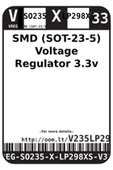
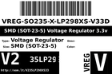
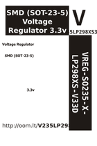

Contents
========

* [V235LP298XS33 > SMD (SOT-23-5) Voltage Regulator 3.3v](#v235lp298xs33--smd-sot-23-5-voltage-regulator-33v)
	* [Labels](#labels)
	* [EDA](#eda)
	* [Images](#images)
	* [Tags](#tags)

# V235LP298XS33 > SMD (SOT-23-5) Voltage Regulator 3.3v

- ID: VREG-SO235-X-LP298XS-V33D
- Hex ID: V235LP298XS33
- Name: SMD (SOT-23-5) Voltage Regulator 3.3v
- Description: SMD (SOT-23-5) Voltage Regulator 3.3v
- Long Link: [http://oom.lt/VREG-SO235-X-LP298XS-V33D](http://oom.lt/VREG-SO235-X-LP298XS-V33D)
- Short Link: [http://oom.lt/V235LP298XS33](http://oom.lt/V235LP298XS33)

## Labels
  
  

|label-front|label-inventory|label-spec|
| :---: | :---: | :---: |
||||

## EDA

### Symbols

## Images
  
  

|label-front|label-inventory|label-spec|
| :---: | :---: | :---: |
||||

## Tags

- oompType: VREG
- oompSize: SO235
- oompColor: X
- oompDesc: LP298XS
- oompIndex: V33D
- hexID: V235LP298XS33
- oompID: VREG-SO235-X-LP298XS-V33D
