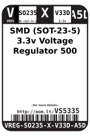
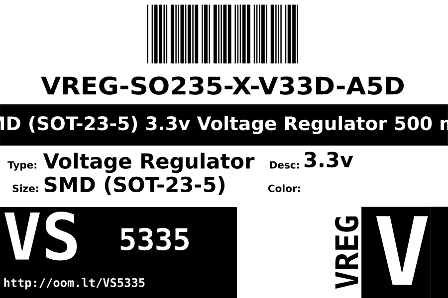
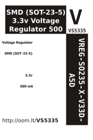

Contents
========

* [VREG-SO235-X-V33D-A5D>SMD (SOT-23-5) 3.3v Voltage Regulator 500 mA](#vreg-so235-x-v33d-a5dsmd-sot-23-5-33v-voltage-regulator-500-ma)
	* [Datasheets](#datasheets)
	* [Labels](#labels)
	* [EDA](#eda)
		* [Symbols](#symbols)
	* [Tags](#tags)

# VREG-SO235-X-V33D-A5D>SMD (SOT-23-5) 3.3v Voltage Regulator 500 mA

- ID: VREG-SO235-X-V33D-A5D
- Name: VREG-SO235-X-V33D-A5D

## Datasheets

- Datasheet: [datasheet.pdf](datasheet.pdf)

## Labels
  
  

|Front|Inventory|Specifications|
| :---: | :---: | :---: |
||||

## EDA

### Symbols

## Tags

- index: 13118
- oompID: VREG-SO235-X-V33D-A5D
- name: SMD (SOT-23-5) 3.3v Voltage Regulator 500 mA
- hexID: VS5335
- oompSort: 
- oompClass: Surface Mount
- oompClassCode: SMDS
- oompType: VREG
- oompSize: SO235
- oompColor: X
- oompDesc: V33D
- oompIndex: A5D
- oompVersion: 40
- ooDesignator: U1
