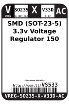
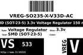

Contents
========

* [VS533 > SMD (SOT-23-5) 3.3v Voltage Regulator 150 mA](#vs533--smd-sot-23-5-33v-voltage-regulator-150-ma)
	* [Datasheets](#datasheets)
	* [Labels](#labels)
	* [EDA](#eda)
	* [Images](#images)
	* [Tags](#tags)

# VS533 > SMD (SOT-23-5) 3.3v Voltage Regulator 150 mA

- ID: VREG-SO235-X-V33D-AC
- Hex ID: VS533
- Name: SMD (SOT-23-5) 3.3v Voltage Regulator 150 mA
- Description: SMD (SOT-23-5) 3.3v Voltage Regulator 150 mA
- Long Link: [http://oom.lt/VREG-SO235-X-V33D-AC](http://oom.lt/VREG-SO235-X-V33D-AC)
- Long Link: [http://oom.lt/VS533](http://oom.lt/VS533)

## Datasheets

- Datasheet: [datasheet.pdf](datasheet.pdf)

## Labels
  
  

|label-front|label-inventory|label-spec|
| :---: | :---: | :---: |
||||

## EDA

### Symbols

## Images
  
  

|label-front|label-inventory|label-spec|
| :---: | :---: | :---: |
||||

## Tags

- oompID: VREG-SO235-X-V33D-AC
- name: SMD (SOT-23-5) 3.3v Voltage Regulator 150 mA
- hexID: VS533
- oompSort: SO2503.30.150
- oompType: VREG
- oompSize: SO235
- oompColor: X
- oompDesc: V33D
- oompIndex: AC
- oompVersion: 99
- oompSkip: true
- ooWidth: 3 mm
- ooHeight: 1.45 mm
- ooLength: 3 mm
- com: SMD
- ooPackageMarking: LPF_
- ooNumPins: 5
- oompClass: Surface Mount
- oompClassCode: SMDS
- ooDesignator: U1
