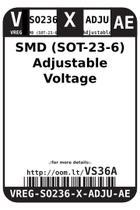
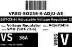
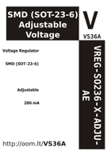

Contents
========

* [VS36A > SMD (SOT-23-6) Adjustable Voltage Regulator 200 mA](#vs36a--smd-sot-23-6-adjustable-voltage-regulator-200-ma)
	* [Images](#images)
	* [Datasheets](#datasheets)
	* [Labels](#labels)
	* [EDA](#eda)
	* [Tags](#tags)
  
![][im]
# VS36A > SMD (SOT-23-6) Adjustable Voltage Regulator 200 mA

- ID: VREG-SO236-X-ADJU-AE
- Hex ID: VS36A
- Name: SMD (SOT-23-6) Adjustable Voltage Regulator 200 mA
- Description: SMD (SOT-23-6) Adjustable Voltage Regulator 200 mA

## Images
  
  

|image|image_RE|image_BOTTOM|label-front|label-inventory|label-spec|
| :---: | :---: | :---: | :---: | :---: | :---: |
|||||||

## Datasheets

- Datasheet: [datasheet.pdf](datasheet.pdf)

## Labels
  
  

|label-front|label-inventory|label-spec|
| :---: | :---: | :---: |
||||

## EDA

### Symbols

## Tags

- oompID: VREG-SO236-X-ADJU-AE
- name: SMD (SOT-23-6) Adjustable Voltage Regulator 200 mA
- hexID: VS36A
- oompSort: VREGSO236ADJU
- oompType: VREG
- oompSize: SO236
- oompColor: X
- oompDesc: ADJU
- oompIndex: AE
- oompVersion: 98
- ooDesignator: U1

[im]: image_450.jpg
